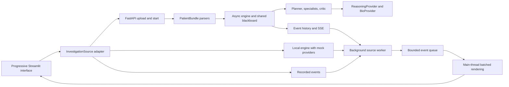

> **Earlier prototype architecture.** The default app now uses the authoritative scientific engine. See [current integration](docs/FULL-STACK.md) and [startup](README.md). This document applies to `frontend/legacy_app.py`.

# TRACE architecture

Implementation snapshot, 19 September 2026. Read [INTEGRATION.md](INTEGRATION.md)
for teammate change boundaries, [DeveloperREADME.md](DeveloperREADME.md) for setup,
and [infra/DEPLOYMENT.md](infra/DEPLOYMENT.md) for hosted verification.

TRACE helps a scientist investigate uploaded evidence, configure agents and inspect
their source-linked findings and criticism. Results contain heuristic confidence,
an abstention gate and explicit weak points. Observational inputs and agent
agreement do not establish mechanistic causation or a validated diagnosis.

## Runtime and independent change boundaries

| Change | Owning boundary |
|---|---|
| Datasets and biological input normalization | `app/ingest.py`, `app/models.py`, corpus/sample files |
| Models and external services | Protocols in `app/providers/base.py`, provider adapters and server settings |
| Planning, scheduling or evidence policy | `app/engine.py`, `app/agents/`, `app/weak_points.py` |
| Replacement backend or different transport | `frontend/ui/adapters.py` source and `frontend/ui/stream.py` contract |
| New backend event field names | Normalize before `frontend/ui/events.py` and `state.py` |
| Product language and defaults | `frontend/ui/config.py` ProductProfile |
| Layout, graph, tips and scientific visuals | App, layout, components, theme and help-text modules |
| Optional browser voice | `frontend/ui/voice.py` and `frontend/static/voice.*` |

The UI does not import backend domain models. A replacement backend can keep its
own data/schema and translate into the small event interface.

The engine uses ordinary Python asyncio. NVIDIA Agent Toolkit is not integrated.
Brev supplies hosting; the CPU demo does not prove working GPU BioNeMo inference.

## Task-aware teams, skills and idea review

`RunConfig.task_mode` accepts `auto`, `investigation`, `idea_review`. Omitting it
retains the existing investigation behavior. The frontend can explicitly request
Auto. The server uses conservative, visible text rules: an explicit idea/proposal
review request selects review; a treatment-failure question without files still
uses investigation and its evidence gate. Explicit mode selection overrides the
router. Config records requested/effective mode and the routing reason.

`app/skills.py` owns the executable product-role catalog. Skills are task planning,
variant analysis, clinical context, evidence review, proposal development,
assumption challenge and critical synthesis. They describe implemented roles, not
installed Codex plugins or arbitrary model-granted permissions. Capabilities expose
`skills`, `task_modes`, `review_roles`, `review_roster_fixed`. Agent-spawn payloads
and summaries carry `skills` IDs, an allowlisted `icon` ID and `alignment`:
`supporting`, `challenging`, or `neutral`. The frontend maps IDs to native SVGs;
backend values never become executable SVG markup. Alignment expresses assigned
perspective, not truth, confidence or scientific support.

Evidence investigation retains explicit specialist roster/model controls. Idea
review has a fixed, honest five-role team: planner, research, supporter, challenger,
critic. Evidence-specialist overrides are rejected for review instead of silently
ignored. The research stage inventories up to three supplied records per type,
with actual file/line provenance, and explicitly performs no external search or
scientific validation. The supporter proposes, the challenger
receives and replies to that argument, the supporter revises using the challenge,
and the critic reads the resulting transcript. Each debate turn makes a real
provider `step` call, or its clearly labelled mock equivalent. This bounded sequence
avoids an unbounded debate loop and works from a question alone.

Review output is separate `Report.discussion`, never fabricated scientific
`findings`. Directed `agent_message` events carry `payload.discussion` and `to`,
with the recipient in `parent_id` for graph connections. Discussion items include
IDs, phase, assigned alignment, text, basis, assumptions, evidence references,
open questions and `reply_to`. The terminal event repeats the discussion. Proposal
arguments have empty provenance; only the bounded input inventory has actual
source references. If an opening or challenge fails, revision is skipped and the
critic identifies the incomplete contributions. The verdict explicitly withholds
scientific validation. The UI presents
proposal feedback without treating zero confidence as a scientific estimate.

## Scientist control and responsiveness

The four interface stages are Evidence, Question & agents, Investigation, Results.
A persistent editable question draft is separate from copied submitted requests.
Editing the draft never changes the current run. Starting another investigation
requires an explicit action after the active job ends.

`BackgroundRun` owns a source iterator, copied request, daemon worker and queue
with default capacity 1,024. The worker never calls Streamlit or Session State.
A main-thread fragment runs every 0.3 seconds during execution, drains up to
256 events and paints once per batch. It keeps draining when the user changes
sections. Completion stops automatic polling. Only one active job is admitted
per session, so old jobs are not merged into a new run.

This removes painting from event production's critical path. Previously each
synchronous paint also paused the local Demo source's asyncio engine. A
120-second unpolled lease prevents an abandoned full queue blocking forever;
the lease is not a durable remote-job cancellation guarantee.

Voice is optional and uses Streamlit 1.64 components v2 plus browser speech APIs.
Recognition requires disclosure, opt-in and an explicit microphone button.
Users review/edit text before applying it to the question draft. Command mode
allows only navigation to the four stages, through the same availability guards
as buttons; it cannot submit or cancel a run. Browser recognition may use its
vendor's service, disclosed before enabling it. TRACE receives only applied text.
Optional speech reads fixed planner, critic and terminal workflow updates. A voice
picker and explicit preview prefer enhanced/natural English device voices when
available. Online browser voices appear only after a separate disclosure/opt-in
and require explicit selection; questions and scientific findings are never spoken.
Unsupported browsers retain typed input and on-screen status.

## HTTP and lifecycle contract

| Route | Purpose |
|---|---|
| `POST /upload` | Repeated multipart `files`; retain raw text and return file IDs |
| `POST /demo/sample-patient` | Load synthetic bundled inputs; same response as upload |
| `GET /capabilities` | Configured roles/models, provider mode and cancellation support |
| `POST /investigate` | Accept `{question, file_ids, config?}`; return `{run_id}` immediately |
| `GET /events/{run_id}` | Replay history and follow SSE JSON `data:` frames |
| `POST /runs/{run_id}/cancel` | Stop and await work; return `{run_id, status}` |
| `GET /report/{run_id}` | Report; full findings and assessments finalized at termination |
| `GET /events/{run_id}/log` | Event history as JSON |
| `GET /runs`, `GET /health` | Demo inspection and health |

Events retain `{type, ts, run_id, agent_id, agent_role, parent_id, payload}`.
Types are `run_started`, `agent_spawned`, `agent_message`, `tool_call`,
`tool_result`, `finding`, `run_complete`, `error`. Timestamps are milliseconds,
made strictly increasing within a run. Findings contain stable IDs, claims, stance,
heuristic confidence, provenance and detailed context. The terminal event includes
verdict information, `status`, `weak_points`, `metrics`, `agent_statuses`,
`task_mode` and `discussion`.
SSE sends keepalive comments every 15 seconds and closes after termination.

Report states are `running`, `complete`, `error`, `cancelled`. Cancellation
awaits child cleanup, handles requests before execution starts, retains partial
findings and emits exactly one terminal event. Repeated cancellation is idempotent;
an existing terminal outcome wins. Closing SSE alone does not cancel the backend.
Agent statuses distinguish done, error and cancelled; a first finding is not an
agent-completion signal. Transport errors never silently switch to recordings.

## Providers, specialists and scientific grounding

`ReasoningProvider` exposes plan, step and synthesize; `BioProvider` exposes variant
scoring and embedding. `RUN_MODE=mock` runs the actual orchestration with simulated
outputs and optional waits. Live adapters use configured endpoints and credentials.
Frontend Demo runs that mock engine locally, Mock replays saved events, and Live
connects to a backend that separately reports its provider mode.

| Agent | Implemented investigation responsibility |
|---|---|
| Orchestrator | Plan tasks or apply the selected specialist roster |
| Genomics | Score variants, interpret scores and retain source provenance |
| Clinical | Inspect uploaded laboratory and note evidence |
| Literature | Rank bundled reference evidence with embeddings and consume peer findings |
| Stats | Internal measurement summaries; not a current selectable evidence role |
| Critic | Check support/conflicts and synthesize with an abstention gate |

Specialists run concurrently and share findings through a blackboard with bounded
peer waits. Genomics uses at most eight score workers by default and coalesces
exact duplicate normalized biological inputs within the run/provider context.
Source metadata is excluded from the computation key and retained on each original
observation's evidence. Reuse is explicit; this is not a cross-patient cache.

The reasoning HTTP adapter separates OpenAI Responses from compatible Chat
Completions. `gpt-rosalind-research` selects Responses in automatic mode. The API
route is documented, but account access and real inference are unverified here.
Output budgets/timeouts are explicit; missing usage remains unknown. See
[Rosalind setup](Context/rosalind-integration.md). BioNeMo mappings remain provisional
pending verification against an actual service.

Findings check references against input/source context. The critic requires
sufficient specialist evidence and may abstain. The deterministic `weak_points`
assessment identifies missing/conflicting evidence, source gaps, provider failures
and scope limits, linking findings and suggested next evidence. These checks
do not prove causal mechanisms, source entailment or calibrated clinical accuracy.

## Measurement and service limits

Reports and terminal events share `wall_ms`, `planning_ms`, `specialists_ms`,
`synthesis_ms`, `variant_requests`, `variant_unique_requests`,
`variant_cache_hits`, `variant_peak_concurrency`. Timings use a monotonic
performance clock. Concurrent specialist phase time is not summed agent time;
variant counts are not all model requests or token counts. Interrupted phases
may retain zero rather than a fabricated completed duration.

[Performance trials](Plan/performance-check.json) preserve identical findings and
verdict hashes across before/after cases. Sixty repeated variant rows now need
five score calls instead of 60; peak simultaneous calls fall from 60 to five.
Median mock time remains approximately 0.56 seconds. This demonstrates resource
efficiency, not faster live inference. [The review](Plan/architecture-review.md)
and `eval/` separate software-lifecycle measurements from model evaluation.

Files, runs and event history are process-local: use one API worker; restart loses
IDs. There is no durable queue, per-user ownership, API authentication, resume
cursor or retention enforcement. Brev's access gate does not add those application
properties. Server event histories/subscriber queues are not globally bounded.
Follow [infra/README.md](infra/README.md) for deployment.

Run-scoped HTTP connection reuse and a versioned reference-embedding cache remain
future optimizations. Evidence-linked biological imagery and mechanism comparison
artifacts in [visual-storytelling.md](Plan/visual-storytelling.md) are proposals,
not implemented endpoints.
