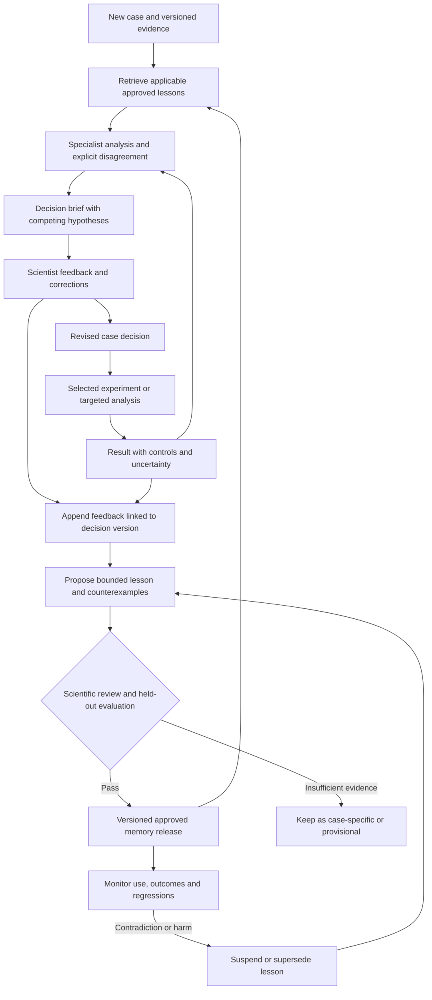

# Agentic scientific learning loop

The goal is for the translational team to become better at deciding what evidence means, which competing explanations remain credible, and which experiment to run next. A scientist's correction should improve the current case and, when justified, become a reusable lesson for future cases. Improvement must be demonstrated on cases that did not supply the feedback.

This is a proposed extension to the [translational hypotheses and agent architecture](TRANSLATIONAL_SCIENCE_HYPOTHESES.md). The roles below describe the intended system. They do not imply that Rosalind, BioNeMo, or the current prototype already implements persistent learning or model training.

## Two connected loops

The **case loop** revises a specific scientific decision as specialists, scientists, and experiments supply evidence. The **learning loop** asks whether a correction should change how the team approaches other cases. Saving a correction is immediate; activating a general rule requires review and evaluation.



Stop the case loop when the decision is adequately supported, evidence is insufficient and requires new data, or the agreed time/tool budget is exhausted. Do not create extra debate rounds solely to manufacture agreement. An unresolved decision with a useful next experiment is a valid outcome.

## Scientist experience

Present a concise decision card: the question, leading and alternative hypotheses, linked evidence, uncertainty, proposed experiment, and what would change the recommendation. Show the lessons used and the decisions they affected.

A scientist can highlight a claim or experiment and choose **correct fact**, **missing alternative**, **unsupported inference**, **confidence too high/low**, **experiment does not discriminate**, **tool/assay misused**, or **useful decision**. Free text remains available. Ask for the corrected decision and a short reason; allow an evidence link and an applicability boundary. A thumbs-up alone records usefulness, not a scientific truth label.

For example: “This structure supports a possible mechanism, but it does not establish resistance. Keep the exposure and assay explanations open, and request a functional comparison before ranking the mechanism highly.” The system shows the revised decision and a separate draft lesson for review. The scientist can accept the case correction while rejecting its broader reuse.

Record feedback when it occurs, even if the experiment is months away. Later results attach to the original decision and prediction without rewriting either. A good experimental decision can yield a negative result; a correct guess can have weak scientific support. Score the decision process and the eventual outcome separately.

## What the system saves

Use durable records with stable identifiers and explicit links. A retrieval index is a rebuildable view of these records, not the authoritative store.

| Record | Required content | Reuse boundary |
| --- | --- | --- |
| Decision episode | Case and decision IDs; question; evidence cutoff; input/artifact hashes; competing hypotheses; concise evidence-based rationale; uncertainty; next experiment; tool/model/prompt versions; retrieved lesson versions | Case history; preserve each revision |
| Feedback event | Event ID; targeted decision/claim; reviewer and discipline; timestamp; feedback category; correction; rationale; supporting evidence; scope; suggested counterexample | Reviewer judgment, pending adjudication where needed |
| Outcome event | Linked prediction and experiment; protocol and controls; result and uncertainty; QC state; missing or delayed endpoints; provenance | Experimental evidence only within the assay's scope |
| Lesson | Trigger; recommended decision behavior; rationale; scope and exclusions; supporting and contradicting episodes; reviewer; evidence status; version; evaluation reference | Candidate until approved for a defined scope |
| Memory release | Immutable lesson versions; review decisions; evaluation manifest/results; release owner and timestamp; previous release | Reproducible set of lessons active for a run |
| Use event | Case ID; memory release; lessons retrieved, applied or rejected; applicability rationale; decision revision; eventual feedback/outcome | Audit trail and regression monitoring |

Keep factual knowledge, procedural lessons, and presentation preferences distinct. “This experiment reported this phenotype” belongs in the evidence store. “Require an orthogonal assay before elevating this claim” is a procedural lesson. “Show the timeline first” is a presentation preference. None substitutes for the others.

Keep patient identifiers and restricted case details in the approved case store. Put de-identified lessons and permitted examples in shared memory. Repository examples must be synthetic or cleared for sharing; raw feedback and patient-level records are not automatically suitable for Git.

## Turning feedback into a generalizable lesson

1. **Anchor the correction.** Link it to the exact claim, evidence available at the time, and resulting decision change. Preserve the original prediction.
2. **Classify the failure.** Identify the scientific error, such as confusing plausibility with causality, overlooking exposure, ignoring assay limitations, or choosing an experiment that cannot distinguish hypotheses.
3. **Extract a conditional rule.** State “when these conditions hold, take this action, because of this evidence standard.” Specify when the rule does not apply.
4. **Find support and contradictions.** Deduplicate repeated comments on the same case. Look for independent episodes and counterexamples. Agent agreement and multiple reviews of one dataset do not create independent evidence.
5. **Review the scope.** The relevant scientist checks scientific content; a reviewer from another discipline challenges transfer and possible failure modes. Preserve unresolved disagreement.
6. **Evaluate the candidate.** Compare decisions with and without the lesson on development cases, then on a locked holdout. Log both improvements and regressions.
7. **Publish a memory version.** Activate only the scope supported by review and evaluation. Keep insufficiently supported lessons provisional and local to the originating case.
8. **Revisit after use.** Incorporate negative outcomes and counterexamples. Narrow, suspend, or supersede a lesson when its assumptions fail.

One expert correction may justify an immediate case fix or a procedural guard against a clear error. It does not establish a universal biological mechanism. Biological generalization requires suitable independent evidence, even when reviewers agree.

### Illustrative lesson record

This example is synthetic and describes a decision procedure; it makes no claim about a particular ALK variant's measured phenotype.

```yaml
lesson_id: SCI-LESSON-001
version: 1
status: candidate
kind: scientific_decision_procedure
trigger: Resistance mechanism is inferred primarily from a predicted structure
action: Keep mechanism provisional and request orthogonal functional evidence
rationale: The current evidence supports plausibility but does not resolve causality
scope:
  question: Variant-associated drug resistance
  evidence_state: Structural prediction without matched functional validation
exclusions:
  - Matched functional evidence already addresses the causal question
  - Task is limited to generating structural hypotheses
supporting_episode_ids: [synthetic-case-A]
contradicting_episode_ids: []
review:
  scientific_reviewer: null
  transfer_reviewer: null
evaluation:
  manifest_id: null
  result: not_evaluated
supersedes: null
```

The activation service must reject this record as active memory while review or evaluation is missing. Schema validity alone does not constitute scientific approval.

## Roles and decision authority

| Role | Responsibility in the learning loop |
| --- | --- |
| Scientist reviewer | Correct the decision, explain the evidence standard, and specify scope |
| Translational integrator / Rosalind role | Revise the case brief, preserve alternatives and unresolved disagreements, and choose the next evidence-producing step |
| Bioinformatics and pathology reviewers | Assess whether feedback overlooks QC, sampling, detection limits, or specimen context |
| Clinical science and pharmacology reviewers | Challenge timing, exposure, treatment context, and clinical transfer |
| Structural biology and wet-lab reviewers | Distinguish mechanistic predictions from measurements and assess discriminating experiments |
| Biostatistics / evaluation owner | Define splits, rubric, uncertainty reporting, leakage controls, and promotion criteria before evaluation |
| Memory curator agent | Draft lessons, identify duplicates and contradictions, and propose scope; cannot approve its own lesson |
| Release owner | Approve the evaluated memory version and own suspension or rollback |

These are logical responsibilities; the MVP can implement them as sequential steps with named human reviewers. More agent instances are not a prerequisite. Disagreement goes to an appropriate scientific reviewer, with both positions retained. A majority vote among similar agents is not a substitute for independent evidence.

## How approved memory changes future work

Before retrieval, fix the run's memory release and evidence cutoff. Filter lessons by project access, approval state, scientific question, evidence type, assay/model context, and scope exclusions. Rank the remaining candidates for relevance and supply a bounded set to the specialist that needs them.

Require each applied lesson to include its ID/version, applicability explanation, and the action it changes. A lesson may add an exposure check, lower an unsupported confidence level, route a question to another specialist, or change the proposed experiment. Retrieve counterexamples alongside the lesson. When there is no good match, proceed with the baseline workflow and record that no lesson applied.

Treat retrieved text and feedback as scientific data with provenance, not executable instructions. They cannot silently alter permissions, evidence, scoring rules, tool configuration, or the active release. Store proposed prompt/routing changes as reviewed versioned artifacts. The initial learning mechanism is explicit memory and workflow revision; it does not update model weights.

Optional future fine-tuning would require a separate curated training set, rights/access review, evaluation, and release process. Repeated exposure to corrections in a conversation does not establish persistent model learning.

## Demonstrating better scientific decision quality

Compare four conditions with the same case inputs, model version, tools, and compute budget:

| Condition | What it measures |
| --- | --- |
| Frozen team without learned memory | Baseline decision quality |
| Team retrieving raw past cases | Whether case recall alone helps |
| Team retrieving approved generalized lessons | Whether abstraction improves transfer beyond recall |
| Team with lessons plus structured challenge step | Whether targeted review adds value beyond retrieval |

Use blinded, order-randomized scientist scoring. Where feasible, reviewers of the holdout should not have authored the lessons. A model judge may assist with organization, but cannot be the sole basis for a scientific improvement claim. Retain reviewer disagreement and adjudication.

| Dimension | Assessment |
| --- | --- |
| Evidence fidelity | Are key claims supported by the cited source and its actual limits? Count unsupported consequential claims separately. |
| Alternative explanations | Does the brief address relevant technical, exposure, biological, and sampling alternatives without adding irrelevant lists? |
| Uncertainty and calibration | Does confidence match the evidence? Use Brier score only for well-defined probabilistic predictions with appropriate observed labels. |
| Experiment quality | Would the proposed result distinguish leading hypotheses? Are controls, feasibility, and interpretations specified? |
| Decision utility | Does the brief identify a justified next action or a useful reason to defer? Measure scientist correction burden. |
| Generalization | Does improvement persist on unseen variants, mechanisms, cohorts, or disease contexts within the proposed scope? |
| Efficiency and regressions | Report latency, tool cost, irrelevant lesson use, over-abstention, and failures in each case category. |

For rubric-based dimensions use anchored scores: 0 = absent or scientifically wrong; 1 = material omission; 2 = adequate with limitations; 3 = well-supported and decision-relevant. Agree on anchors, primary endpoint, minimum useful improvement, acceptable regression margin, and sample-size rationale before opening the holdout. Report paired differences and uncertainty; do not claim validated improvement from a small demonstration.

### Leakage and promotion controls

Split by patient and related experimental series, not individual rows. Keep duplicate publications, assay replicates, and near-identical variants together where they would reveal the answer. Add a temporal split for prospective claims and a mechanism/family split when testing broader transfer. Save dataset versions and split membership.

Freeze prompts, tool settings, memory, retrieval corpus, and scoring before the final holdout. Keep its labels and feedback out of retrieval and lesson generation. A case used to author a lesson becomes development data; retire it from future claims of unseen-case performance. For public benchmarks, record possible model pretraining contamination: hiding a label from retrieval alone does not prove the model has never seen it.

Promote only when reviewers accept the scope, the predeclared primary endpoint improves by the chosen criterion, regression limits pass, and no unresolved critical failure remains. If the evidence is too small or uncertain, retain candidate status. Test out-of-scope negative controls to detect rules that are being applied too broadly. Evaluate wider biological transfer as a new promotion decision.

## ALK demo tied to Easy / Stretch / Novel

This sequence demonstrates the proposed learning behavior. It does not validate the biological claims or dataset details in the companion hypothesis catalog.

| Stage | Demonstration | What may be learned |
| --- | --- | --- |
| Easy: known resistance adjudication | A scientist corrects an overconfident conclusion that omitted an exposure or assay check. Show the original brief, feedback, and revised brief. | A conditional evidence-checking procedure, with the known label kept separate |
| Stretch: P1153R mechanism exploration | Present the competing conformational, catalytic, binding-state, and allosteric hypotheses from the catalog. Feedback challenges an experiment that would not separate them. | How to align an experiment's observable result with competing predictions, without saving an unproven mechanism as fact |
| Novel: unseen candidate VUS | Apply only the approved procedural lesson to a disjoint case; retain artifact, passenger, and bypass explanations where relevant. | Evidence of procedural transfer, pending independently assessed results |

Show a deliberately out-of-scope case as well: when matched functional evidence already answers the narrow question, the structural-evidence lesson should not demand the same experiment again. Finally, introduce a counterexample, suspend the lesson, and replay the affected decision under the previous memory release.

Success is visible as better-supported reasoning and a more discriminating next experiment on the unseen case. Do not script the target mechanism into the retrieved lesson and then call its repetition a discovery.

## Minimal implementation plan

1. **Capture and replay.** Add decision IDs, feedback events, immutable revisions, and an original-versus-revised decision view. Persist feedback across process restarts; prevent duplicate submission with an idempotency key.
2. **Curate memory.** Add structured lesson records, explicit review states, scope/exclusions, contradiction links, and an immutable release manifest. Start with inspectable files or a transactional database; add semantic retrieval only when needed.
3. **Apply and audit.** Load one release per run, filter before ranking, log applied/rejected lessons, and show their effects to the scientist. Connect existing evidence/artifact identifiers where available; keep feedback and release records separate from model outputs.
4. **Evaluate transfer.** Build development and locked holdout manifests, blinded scoring forms, paired reports, and out-of-scope tests. Do not allow a candidate generator to write holdout labels or promotion results.
5. **Operate and revise.** Add outcome follow-up, drift review, suspension, and rollback. Identify affected cases through use events and queue them for reassessment when a lesson is withdrawn.

Proposed record collections are `decision_episodes`, `feedback_events`, `outcome_events`, `lessons`, `memory_releases`, `lesson_uses`, and `evaluation_runs`. Repository storage is for schemas, sanitized examples, and approved shareable documentation; deployment storage and access controls must match the actual research data.

Candidate lessons move through `candidate -> reviewed -> evaluated -> active`. Failed evaluations return to candidate status with the failure retained. Active lessons can become `suspended` or `superseded`; never overwrite old versions. Pin a release at run start. A critical suspension should flag in-flight runs for reassessment rather than silently changing their context. Rollback restores the previous release for new runs and marks affected prior decisions; it does not erase scientific history.

### Acceptance checks for implementation

- Feedback survives a restart and remains linked to the exact decision version.
- A case correction can be saved without creating or activating a general lesson.
- Unapproved, suspended, inaccessible, or out-of-scope lessons cannot enter active retrieval.
- Each changed decision identifies the lesson version and supporting evidence it used.
- Conflicting reviewers and failed experiments remain visible; missing outcomes are not counted as successes.
- A holdout case and its labels cannot enter candidate generation or retrieval during evaluation.
- Reports distinguish within-case correction, unseen-case transfer, and unvalidated wider generalization.
- Suspending a lesson identifies affected cases; the prior release remains available for replay.

## Open design decisions

The implementation team must choose the scientific release owner, reviewer availability, permitted data-sharing scope, benchmark datasets, primary evaluation endpoint, and tool/latency budget. Start with one narrow resistance-adjudication workflow. Broaden the lesson scope only after measuring transfer and reviewing its counterexamples.
