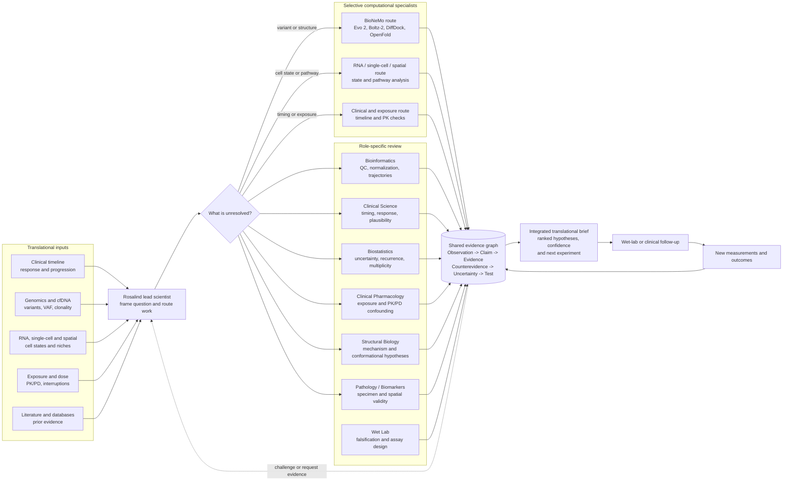
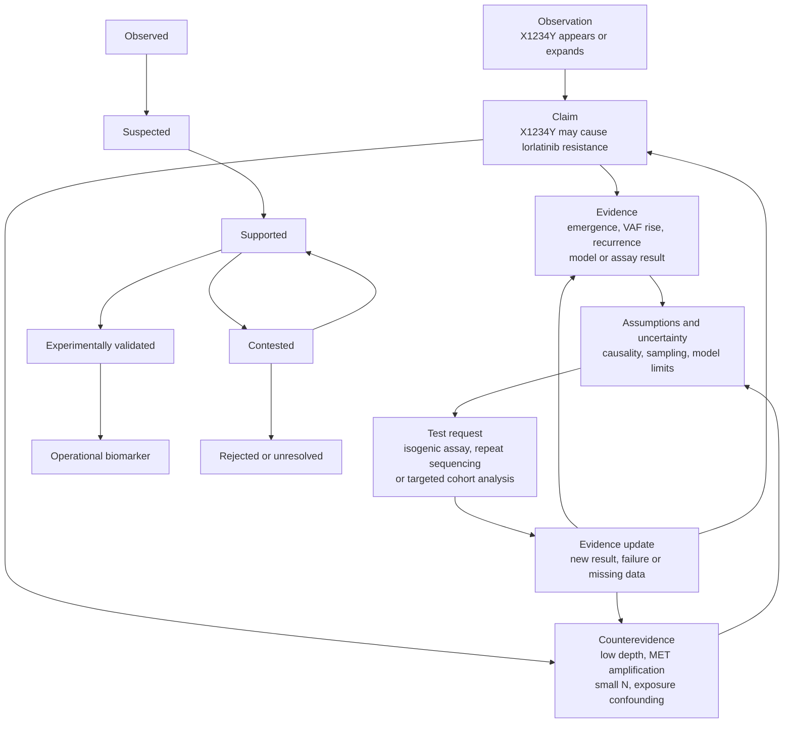
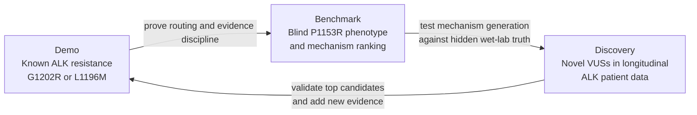

# Translational science hypotheses for ALK and non-genetic resistance

This document consolidates the translational-science questions developed for the Rosalind workflow. It is a hypothesis and experiment map, not a claim that any proposed mechanism has been established. Dataset names, release identifiers, cohort sizes and assay definitions must be checked at acquisition and recorded with checksums before a result is treated as evidence.

The central design principle is to separate what is already observed from what is inferred. A known resistance phenotype can be used to test whether the team explains an established result. A stretch question asks for a discriminating mechanism. A novel question asks whether longitudinal, multimodal evidence can reveal a previously unrecognized resistance process and produce a prospective test.

## Easy, stretch and novel roadmap

| Tier | Use case | Core question | Main theories | Dataset or test bed | Team output | Scientific novelty |
| --- | --- | --- | --- | --- | --- | --- |
| Easy | Known ALK resistance adjudication | Is an emerging ALK mutation a real inhibitor-resistance mechanism? | Direct binding disruption versus exposure, assay-quality, passenger or co-driver explanations | The discussed ALK functional atlas; paired baseline/progression sequencing; longitudinal ALK cfDNA cases | A calibrated evidence brief with timing, exposure, assay and structural checks, plus a validation plan | Low, 1/5. Best for workflow correctness and known-label benchmarking. |
| Stretch | Explain ALK P1153R broad-TKI resistance | Why does P1153R resist multiple ALK inhibitors? | Altered alpha-C/P-loop dynamics; higher ATP affinity or catalytic activity; destabilized inhibitor-bound state; long-range electrostatic or allosteric propagation | Functional measurements across alectinib, lorlatinib and zotizalkib, structural models, kinase and binding assays | A mechanism ranking and experiments that distinguish the mechanisms | High, 4/5. The phenotype is available; the causal explanation remains open. |
| Novel | Discover unexplained ALK resistance variants and mechanisms from longitudinal patient data | Are emerging ALK VUSs at progression previously unrecognized resistance drivers? | True driver versus passenger, artifact or bypass clone; binding, conformational, catalytic, allosteric and compound-mutation mechanisms | Longitudinal tissue and cfDNA, treatment exposure, response timing, matched RNA and functional follow-up | A blinded discovery set, orthogonal validation and a prospectively testable resistance signature | Very high, 5/5 if a reproducible mechanism and validation assay emerge. |

The tiers are staged. Easy work establishes data contracts and prevents overclaiming. Stretch work tests whether agents can turn a known phenotype into a falsifiable mechanistic argument. Novel work is reserved for hypotheses that survive those checks and have an independent validation path.

## Visual agent flows and architecture

The product architecture discussed in the chat is a translational program team rather than a single model with a tool belt. Rosalind owns question framing, routing, evidence synthesis and the decision brief. Specialist roles have different responsibilities and different reasons to challenge a claim. BioNeMo is called selectively when the unresolved question is molecular; a transcriptomic, clinical or exposure question should follow a different route.

The earlier interactive architecture view is represented here as versioned Mermaid diagrams so it remains reviewable in the repository.

### System architecture: evidence in, selective specialist calls, experiment out



The key design choice is tool selection. Rosalind may route a coding variant near a binding site to BioNeMo, a mutation-negative progression signal to RNA or spatial analysis, and an apparently resistant case with dose interruptions to clinical pharmacology first. A tool result enters the evidence graph as one piece of evidence; it does not decide the clinical conclusion.

### Illustrative ALK flow: disagreement changes the hypothesis

This sequence shows the back-and-forth discussed for an emerging ALK VUS. The patient identifiers and variant are illustrative placeholders for a demo, not clinical evidence.

```mermaid
sequenceDiagram
    participant T as Translational scientist
    participant R as Rosalind lead
    participant B as Bioinformatics
    participant C as Clinical Science
    participant P as Clinical Pharmacology
    participant S as Structural Biology
    participant N as BioNeMo
    participant W as Wet Lab

    T->>R: X1234Y emerges near progression
    R->>B: Verify depth, allele balance, VAF and clonality
    B-->>R: P02 fails QC; P01 and P03 remain credible
    R->>C: Align variant with response, progression and disease site
    C->>P: Could dose or exposure explain the signal?
    P-->>C: P01/P03 adequately exposed; exposure confounding is reduced
    C-->>R: Association remains plausible, not causal proof
    R->>S: Compare direct pocket, distal and bypass mechanisms
    S->>N: Model matched WT and mutant ALK-lorlatinib states
    N-->>R: Interaction geometry is supportive but uncertain
    R->>B: Check recurrence, co-alterations and bypass signals
    B-->>R: MET amplification confounds P01; P03 is cleaner
    R->>W: Propose isogenic X1234Y versus WT dose-response assay
    W-->>R: Return blinded functional result and control checks
    R-->>T: Update claim, confidence, counterevidence and next action
    R->>B: Request the next targeted analysis if uncertainty remains
```

The system should be able to revise the claim from “three of three progressors acquire X1234Y” to “two independently progressing, adequately exposed cases retain a credible signal” after QC and exposure review. That revision is a product feature: the team preserves disagreement and improves the experiment rather than forcing early consensus.

### Shared evidence graph and claim states

Every agent reads and writes structured evidence rather than leaving conclusions in isolated prose. A claim can carry supporting evidence and counterevidence at the same time.



The claim state is deliberately richer than true/false. “Supported” can still carry a serious objection; “experimentally validated” requires the predefined assay and controls; “operational biomarker” additionally requires a prospective measurement and decision-use case.

### Roadmap architecture: Demo -> Benchmark -> Discovery



The three stages answer different questions: can the team reason correctly, can it explain a known but unresolved phenotype, and can it find something not already annotated? The same evidence graph and role-based loop support all three stages.

## Hypothesis catalogue

### 1. Known ALK resistance adjudication

**Question.** Given a newly observed ALK variant during treatment, is it a causal resistance mechanism, a passenger, a technical artifact or a marker of another escape route?

**Competing hypotheses.**

- The variant changes inhibitor binding or the kinase conformational ensemble and is sufficient to reduce drug response.
- The variant changes ATP competition or catalytic output, making the inhibitor concentration insufficient at the observed exposure.
- The variant is correlated with progression but is not causal; a co-mutation, bypass pathway, lineage change or inadequate exposure explains the phenotype.
- The apparent call reflects low coverage, mapping error, clonal sampling, a germline variant or a cfDNA detection artifact.

**Falsifiable tests.** Blind the phenotype where possible; verify reference and alternate alleles, purity, depth and clonality; align the variant with treatment start, response and progression; measure exposure and dose interruptions; reproduce the effect in an isogenic model; measure biochemical binding and kinase activity; and test whether a rescue inhibitor restores pathway control. A causal claim should require at least two orthogonal lines of evidence and should state what result would disconfirm it.

### 2. ALK P1153R and broad-TKI resistance

The discussed functional atlas reports P1153R resistance to alectinib, lorlatinib and zotizalkib. That phenotype is a starting point, not a mechanism. The team should first predict the hidden phenotype, then reveal it and force a mechanism choice.

#### H2a: altered alpha-C/P-loop conformational dynamics

P1153R may shift the alpha-C helix, beta3 strand or P-loop ensemble toward states that are poorly compatible with multiple inhibitor-bound conformations. The mutation could change the frequency or lifetime of an active-like state without requiring a large static structural displacement.

**Discriminators:** matched wild-type and P1153R structures or ensembles; molecular-dynamics or enhanced-sampling analysis; hydrogen-deuterium exchange or NMR where available; inhibitor residence time; and a panel of inhibitors that prefer distinct kinase conformations. The hypothesis is weakened if dynamics are indistinguishable from wild type while binding and activity change through another route.

#### H2b: increased ATP affinity or catalytic activity

P1153R may increase ATP affinity, catalytic turnover or both, so a fixed inhibitor concentration loses competition even when inhibitor binding is otherwise preserved.

**Discriminators:** Michaelis-Menten measurements for ATP and substrate; inhibitor-response curves at several ATP concentrations; (K_m^{ATP}), (k_{cat}), (k_{cat}/K_m), biochemical IC50 and cellular pathway inhibition; and rescue by increased inhibitor exposure. The hypothesis is weakened if ATP parameters remain unchanged and resistance persists under matched intracellular exposure.

#### H2c: destabilization of the inhibitor-bound state

The mutation may permit initial binding but shorten residence time or increase dissociation, producing apparent resistance that is missed by equilibrium affinity alone.

**Discriminators:** kinetic association and dissociation, residence-time measurements, thermal or conformational stability, cellular target engagement and washout experiments. A stable equilibrium (K_d) with a markedly shorter residence time would support this mechanism.

#### H2d: long-range electrostatic or allosteric propagation

The substituted residue may alter charge distribution, water networks or coupled motions that transmit into the ATP pocket and inhibitor contacts without being a direct contact residue.

**Discriminators:** electrostatic surface calculations, perturbation-response or network analysis, charge-reversal and conservative substitutions, double-mutant cycles, and a focused inhibitor panel with different polar or charged interactions. The hypothesis is weakened if effects disappear after controlling for ATP competition and local pocket geometry.

**Decision rule.** Do not collapse these hypotheses into a single structural story. Rank them with preregistered predictions and update the ranking as structural, biochemical and cellular evidence arrives.

### 3. K1150dup: lorlatinib resistance with gilteritinib rescue

The motivating observation is that K1150dup may resist lorlatinib while remaining vulnerable to gilteritinib. The key question is why two inhibitors with overlapping target intent separate in this way.

**H3a: inhibitor-compatible conformation.** The duplication changes the local backbone or conformational ensemble so that the lorlatinib-bound geometry is disfavored, while gilteritinib can bind an alternative state.

**H3b: steric or access-path difference.** The duplicated segment creates a kinetic or steric barrier for lorlatinib entry, exit or induced fit that gilteritinib avoids.

**H3c: ATP-competitive state dependence.** K1150dup changes ATP affinity or kinase activation, and the two drugs differ in their ability to compete under the resulting cellular ATP environment.

**H3d: context and exposure.** The apparent selectivity is caused by intracellular concentration, efflux, protein binding, schedule or cell-line context rather than target geometry.

**Falsifiable tests:** solve or model matched K1150dup complexes; compare on/off kinetics, ATP competition and target engagement; perform a concentration and washout matrix; reproduce in multiple isogenic backgrounds; and test whether gilteritinib rescue persists after exposure matching. The strongest result would be a mutation-specific rescue that tracks a biochemical mechanism across independent systems.

### 4. Distal ALK resistance mechanisms

Resistance need not occur at the inhibitor contact surface. Candidate distal mechanisms include altered alpha-C/P-loop coupling, activation-loop dynamics, domain packing, solvent or water-network rearrangement, kinase stability, chaperone dependence, dimerization, trafficking or altered protein abundance.

**Hypotheses.**

- A distal substitution shifts the active/inactive ensemble and changes which inhibitor conformations are populated.
- The substitution changes protein stability or HSP90 dependence, changing the effective target pool.
- The substitution alters ALK localization, dimerization or adaptor recruitment, producing pathway output that is less sensitive to target engagement.
- A distal mutation is a marker of a second alteration or lineage state rather than the direct cause.

**Tests:** matched expression and degradation measurements; target engagement alongside pathway output; domain and full-length constructs; proximity or dimerization assays; chaperone perturbation; and separation of protein abundance from per-molecule catalytic activity.

### 5. Drug-rescue prediction

**Question.** Can a resistance mechanism be used to predict a drug, combination or schedule that restores control?

**Hypotheses.**

- A structurally distinct inhibitor can rescue by binding a different conformation or interaction network.
- A type-I/type-II or orthosteric/allosteric switch overcomes the altered ensemble.
- A combination suppresses bypass signaling while the ALK inhibitor controls the resistant clone.
- Rescue is illusory because the proposed drug cannot reach the target at a tolerable exposure.

**Test bed and falsification.** Build a blinded mutation-by-drug matrix spanning biochemical binding, target engagement, pathway output, viability and exposure. Pre-specify that rescue must reproduce in at least two models and retain activity at clinically plausible free-drug concentrations. A prediction is rejected when it depends on supratherapeutic exposure, disappears in an independent model or fails to suppress the resistant clone after washout.

### 6. Compound-resistance evolutionary paths

**Question.** How do ALK clones move from one resistance state to a compound state, and does mutation order matter?

**Hypotheses.**

- Sequential selection follows a predictable path through single mutants with partial fitness and cross-resistance.
- Branching evolution produces multiple paths whose endpoint depends on treatment sequence, dose intensity and tissue compartment.
- A first mutation creates a permissive background for a second mutation through altered stability, dynamics or drug exposure.
- Compound variants are rare passengers that expand only after a bypass event.

**Tests:** serial sampling of tissue and cfDNA; single-cell or single-molecule phasing where possible; barcoded isogenic evolution experiments; drug cycling and combination schedules; and fitness measurements without drug. Compare observed paths with a preregistered transition model, while accounting for detection limits and treatment exposure.

### 7. Novel ALK VUS resistance mechanisms from longitudinal data

**Question.** Can longitudinal progression data reveal an ALK variant of uncertain significance that is a reproducible resistance driver?

**Discovery design.** Keep the initial phenotype labels hidden from the reasoning team. Identify variants that emerge or expand at progression, verify that the call is above assay-specific detection limits, connect the time course to drug exposure and response, and prioritize variants with a plausible structural, biochemical or regulatory route. Separate ALK-on-target candidates from bypass-associated clones.

**Competing explanations:** technical artifact; pre-existing subclone missed at baseline; treatment-independent passenger; clonal marker linked to a bypass alteration; or true ALK resistance driver.

**Validation ladder:** independent library or assay confirmation; orthogonal sample or patient; isogenic knock-in and reversion; inhibitor panel; biochemical or target-engagement assay; and a rescue or combination experiment. Novelty is earned only when the mechanism generalizes beyond the discovery specimen.

### 8. Non-genetic osimertinib resistance

The same workflow should support EGFR and osimertinib questions where progression occurs without a sufficient genomic explanation.

**Candidate hypotheses.**

- Drug-tolerant persister cells enter a reversible slow-cycling state.
- EMT or lineage plasticity changes dependency while preserving or reducing EGFR dependence.
- Apoptosis threshold, stress response, chromatin state or transcriptional memory changes drug response.
- RTK, MET, AXL, IGF or other bypass signaling maintains downstream output.
- Altered drug uptake, efflux or lysosomal sequestration reduces intracellular exposure.
- A subclonal genomic change is present below tissue or plasma detection limits.

**Discriminators:** treatment time course with washout and rechallenge; single-cell RNA/ATAC or protein profiling; phosphoproteomics; intracellular drug measurement; apoptosis and cell-cycle measurements; and matched DNA, RNA and clinical exposure. A non-genetic claim must survive washout, reversion and sensitive orthogonal genomic assays.

### 9. Reversible drug tolerance versus stable resistance

**Question.** Is the phenotype a reversible state or a heritable resistance program?

**Predictions.** Reversible tolerance should decay after drug withdrawal, retain a response on rechallenge, and show state or chromatin changes without a stable causal genotype. Stable resistance should persist through drug-free expansion, transmit to daughter cells and show a reproducible genetic or durable epigenetic basis.

**Experiments:** measure kill and regrowth over time; wash out drug for multiple passages; rechallenge at matched exposure; clone single cells before and after treatment; sequence and profile chromatin; and compare lineage barcodes. Report the distribution of recovery times rather than a binary label.

### 10. Mutation-negative ALK resistance

**Question.** What explains progression when no convincing ALK mutation is detected?

**Hypotheses:** inadequate coverage or tumor fraction; an undetected ALK alteration; ALK amplification or expression change; bypass activation; lineage or histologic transformation; microenvironmental protection; pharmacokinetic failure; or a pre-existing resistant compartment missed by sampling.

**Tests:** repeat tissue and plasma with orthogonal assays; copy-number and structural-variant analysis; RNA and phosphoprotein readouts; pathology review; drug exposure and adherence; spatial or multi-region sampling; and ex vivo perturbation of candidate bypass pathways. The correct endpoint may be an unresolved cause with a specific next experiment rather than a forced mutation call.

### 11. cfDNA early resistance prediction

**Question.** Can a longitudinal cfDNA signal predict progression early enough to change management?

**Hypotheses:**

- A rising resistance-allele VAF precedes radiographic progression and is drug-specific.
- A polyclonal rise or re-expansion of the original driver is more informative than one resistance allele.
- Low-VAF signals are dominated by assay noise, clonal hematopoiesis or tumor-shedding changes.
- A joint model of VAF, fragment features, treatment exposure and imaging outperforms any single marker.

**Tests:** blinded prospective or nested validation; technical replicates and limit-of-detection controls; lead-time analysis; landmark and time-dependent performance; calibration; false-alert accounting; and explicit handling of missing or delayed samples. The model must be locked before the held-out progression labels are revealed.

### 12. Tumor-ecosystem and spatial resistance

**Question.** Does resistance arise from spatially organized subclones or protection by the tumor ecosystem?

**Hypotheses:**

- Resistant clones occupy niches with distinct stromal, vascular, immune or hypoxic conditions.
- Drug penetration or metabolism varies spatially, creating local underexposure.
- Paracrine signals maintain pathway output despite target engagement.
- A resistant clone is present in one region and absent from another, making a single biopsy misleading.

**Tests:** multi-region DNA/RNA, spatial transcriptomics or proteomics, multiplex imaging, local drug-distribution measurements, organoid or co-culture models, and matched clinical time points. Spatial association is not sufficient; perturb the candidate niche signal and test whether resistance is lost.

## Datasets and test beds

The following resources were discussed as candidate test beds. They are research inputs to verify, version and license before use.

| Test bed | What it can establish | Required provenance and controls |
| --- | --- | --- |
| Discussed 2026 ALK functional atlas, reported as 3,208 variants across alectinib, lorlatinib and zotizalkib | Known resistance labels for blind prediction and mechanism prioritization; includes the P1153R and K1150dup questions | Confirm publication or release, assay definitions, variant normalization, replicate structure, raw values, drug concentrations and access terms; retain a checksum |
| Paired pre/post-lorlatinib clinical cases | Whether a candidate alteration tracks treatment and progression in a patient | Treatment dates, dose changes, response assessments, sample purity, sequencing platform, VAF limits, co-mutations and clinical outcome definitions |
| Longitudinal ALK cfDNA cohort | Clonal dynamics, early resistance signals and mutation-negative intervals | Collection schedule, assay limit of detection, fragment or UMI design, imaging timestamps, exposure, censoring and clonal hematopoiesis controls |
| Isogenic ALK cell models | Causal effect of a single mutation and drug-specific rescue | Independent clones, matched expression, reversion control, authentication, mycoplasma status, ATP context and blinded replicate plan |
| Biochemical ALK kinase and binding assays | ATP affinity, catalytic activity, affinity, kinetics and residence time | Protein construct, phosphorylation state, assay buffer, ATP concentration series, orthogonal readout and positive/negative controls |
| Structural data and predicted ensembles | Plausible conformational or allosteric mechanisms | PDB or model identifiers, experimental resolution or model confidence, ligand state, alignment and independent interface review |
| EGFR/osimertinib longitudinal tissue, plasma and single-cell data | Non-genetic tolerance, bypass and mutation-negative progression | Matched DNA/RNA/protein, washout or rechallenge information, pathology, exposure and sample timing |
| Spatial multi-region tumor samples | Ecosystem and compartment hypotheses | Region registration, spatial platform, cell-type annotation, local drug measurements and region-level sampling uncertainty |

Synthetic fixtures in the Rosalind implementation are plumbing demonstrations only. They must not be used as biological ground truth or presented as patient evidence.

## Falsifiable experiment matrix

| Hypothesis family | Minimum discriminating experiment | Result that would weaken or reject it |
| --- | --- | --- |
| Direct ALK binding resistance | Matched biochemical binding plus cellular target engagement | No mutation-specific binding or engagement change at matched exposure |
| ATP affinity/catalysis | ATP titration, (K_m), (k_{cat}), inhibitor curves and pathway output | ATP parameters and exposure-adjusted response remain unchanged |
| Conformational or allosteric shift | Matched structures/ensemble analysis plus a conformation-diverse inhibitor panel | No ensemble or inhibitor-state difference after controlling for expression |
| K1150dup gilteritinib rescue | Dose, kinetics, washout and isogenic replication | Rescue disappears with exposure matching or fails outside one model |
| Compound evolution | Phased longitudinal sampling plus barcoded evolution | Claimed order cannot be reproduced and is explained by sampling alone |
| VUS discovery | Independent call, knock-in/reversion and orthogonal drug assay | Effect vanishes on reversion or lacks a reproducible drug phenotype |
| Non-genetic osimertinib tolerance | Washout/rechallenge with single-cell state profiling | Phenotype persists as a stable genotype or cannot be reproduced after state reset |
| Mutation-negative resistance | Orthogonal DNA, RNA, protein, exposure and pathology review | A previously missed genomic or exposure explanation accounts for progression |
| cfDNA early prediction | Locked prospective or held-out lead-time validation | Performance does not exceed technical-noise and baseline-only controls |
| Ecosystem/spatial resistance | Spatial association plus perturbation of the candidate niche signal | Spatial correlation is not altered by perturbation |

## Multi-agent translational team workflow

The team is organized around evidence-producing roles. Each role receives a question, a source manifest and explicit failure criteria. No role may convert a model score, a structural confidence value or a correlation into a clinical conclusion without an orthogonal check.

| Role | Primary challenge | Evidence returned to the loop |
| --- | --- | --- |
| Clinical Science | Align variant, exposure, response, progression and sampling time; distinguish progression from measurement noise | A timeline, phenotype label, missingness statement and clinically plausible next sample |
| Bioinformatics | Normalize variants, control purity and batch effects, detect clonal trajectories and preserve provenance | Reproducible calls, QC metrics, VAF/coverage table, cohort split and data hashes |
| Structural Biology | Translate sequence changes into testable conformational, binding or allosteric predictions | Matched models/structures, interface or ensemble observations, uncertainty and discriminating mutations |
| Computational Biology / BioNeMo | Run bounded, versioned sequence or structure tools with correct inputs and interpretation limits | Tool request, model/version identity, artifact hashes, score interpretation and failure state |
| Clinical Pharmacology | Connect in vitro activity to free-drug exposure, dose, schedule, adherence and tissue penetration | Exposure-adjusted plausibility, PK/PD assumptions and a clinically feasible rescue range |
| Wet Lab / Functional Genomics | Turn ranked mechanisms into causal perturbations and rescue tests | Blinded replicate results, controls, reversion/knock-in evidence and assay limitations |
| Pathology / Spatial Biology | Resolve lineage, compartment, microenvironment and sampling effects | Region or cell-state annotations, spatial uncertainty and candidate ecosystem perturbations |
| Rosalind / Integrator | Maintain the question contract, challenge assumptions and write the decision brief | Evidence graph, competing-hypothesis ranking, unresolved items and next experiment |

### Looping evidence protocol

1. **Frame.** Clinical Science and the Integrator define one hypothesis, one question, the relevant time window and a disconfirming observation.
2. **Verify inputs.** Bioinformatics checks the source manifest, assay limits, variant normalization, sample identity and treatment timeline.
3. **Generate independent predictions.** Structural Biology, Computational Biology and Pharmacology return predictions with model versions, exposure assumptions and uncertainty.
4. **Challenge.** A separate role reviews the prediction against technical artifacts, competing mechanisms and clinically plausible concentrations.
5. **Perturb.** Wet Lab or an approved external dataset tests the smallest experiment that separates the top hypotheses.
6. **Update.** The Integrator records which evidence moved each hypothesis, what remained unresolved and what would change the ranking next.
7. **Escalate or stop.** Escalate only when the next experiment is defined and feasible. Stop a claim when it fails a preregistered gate; preserve it as a negative or unresolved result.

Every loop should append to the evidence ledger with the dataset release, code revision, tool/model identity, parameters, artifact hashes, failures and human interpretation. Re-running a tool must not overwrite prior evidence. A structural prediction can prioritize an assay; it cannot replace the assay. A cfDNA signal can trigger sampling; it cannot by itself establish causality.

## Decision and reporting template

For persistent improvement across cases, see [Agentic scientific learning loop](AGENTIC_SCIENTIFIC_LEARNING_LOOP.md): scientist feedback capture, scoped reusable lessons, independent evaluation, memory releases, and rollback. The evidence loop above updates a case; the companion design specifies how reviewed corrections can improve future decisions.

For each investigated case, report:

1. The exact hypothesis and the observation that motivated it.
2. The competing explanations considered and the evidence expected under each.
3. Dataset release, sample and treatment provenance, assay limits and exclusions.
4. The blinded prediction, if one was made, before phenotype labels were revealed.
5. Tool and model versions, parameters, artifacts and failures.
6. The smallest falsifiable experiment and its preregistered interpretation.
7. What changed in the hypothesis ranking after each evidence update.
8. Whether the result is known, stretch, novel, unresolved or rejected.
9. The next clinical, computational or wet-lab action, with its owner and stopping rule.

The desired endpoint is an auditable translational decision: a mechanism that survives orthogonal testing, a rescue strategy with exposure-aware evidence, or a clearly bounded unresolved hypothesis with the next experiment already specified.
