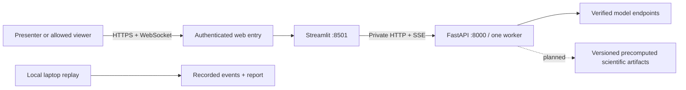

# Hosting and live demo

## Decision

**A live demo is feasible now with connected mock execution or explicit recorded
playback. A live scientific-model demo still needs verified vendor endpoints.**
Use the existing Brev CPU instance for the presentation: one Streamlit service and
one FastAPI worker on the same host, with the API reachable only internally. Keep a
tested local copy and recordings on the presenter's laptop. The next backend can
replace the API container and frontend adapter without changing the hosting shape.

For a service that remains available after the event, prefer a managed CPU web host
such as Render for the UI/API, with GPU work in separate jobs or verified hosted
inference APIs. First add durable jobs and per-user ownership. There is no reason to
keep an expensive GPU running merely to serve the interface.

The Brev option is now deployed at <https://trace-z484f0h2c.gobrev.dev> with NVIDIA
authentication. The UI was verified through SSH forwarding; the HTTPS entry reaches
sign-in, but the complete signed-in browser path still needs a presenter check.
See [the deployment record](../infra/DEPLOYMENT.md). Other hosting options below
remain recommendations; no additional paid hosting or live model calls were used.

## What is actually ready

| Capability | Evidence and implication |
|---|---|
| Existing Brev CPU instance | `agentic-takeoff-cpu`, `London-AI-Brev`, previously verified as `n2d-highmem-4` without a GPU. Read-only checks today found x86_64, Docker, Compose v5.5.1, about 29 GiB available RAM and 969 GiB free disk. Suitable capacity for this small CPU demo is an inference, not a load-test result. |
| Application on that instance | Deployed in `/home/ubuntu/trace-service` as Compose project `trace-demo`. Both containers healthy, API private, UI on loopback and the private Brev mesh interface. Teammates' existing services remain separate. |
| Current application | Streamlit calls the API from Python, not directly from the browser. `TRACE_BACKEND_URL` is already configurable. The default HTTP/SSE contract is replaceable in `frontend/ui/stream.py`. |
| Connected mock run | Real parsing, orchestration, agent selection, grounding checks and event flow; simulated model outputs. Record this as mock execution, never as scientific-model inference. |
| Recorded playback | Frontend JSON fixtures work without a backend. Playback uses the recorded question and outputs, so it cannot answer a newly edited question. |
| Live providers | Rosalind has a tested Responses transport adapter, but live generation requires an approved project's key and remains unverified. BioNeMo routes/models are provisional. NVIDIA Agent Toolkit integration is not implemented. A healthy API does not validate these integrations. |
| Service state | Uploads and runs live in process memory. Cancellation and a per-run variant worker bound are implemented; authentication, tenant ownership, durable jobs and global admission limits are not. One API worker is required. A restart loses IDs. |

## Event topology



Streamlit uses WebSockets and session state; additional replicas need session
affinity. Keep one UI instance during the event. Public requests need only reach the
UI. Backend SSE therefore stays on localhost or the Compose network, avoiding an
extra public streaming connection. [Streamlit architecture](https://docs.streamlit.io/develop/concepts/architecture/architecture)

Use Brev's **Secure Link** for port 8501 if its access policy and browser behavior
work for the intended viewers. NVIDIA documents an authentication redirect, so a
shareable URL is not automatically an anonymous judge URL. Verify another account
can authenticate, upload and receive continuous updates. The configured link allows
only the deploying user's account. [Brev connectivity](https://docs.nvidia.com/brev/cli/connectivity)

The base configuration publishes only `127.0.0.1:8501`. The Brev override also binds
the specific private `wt0` mesh address for the authenticated gateway. Port 8000
remains unpublished. Presenting through SSH port forwarding needs no public URL
and has been verified. Instructions are in
[infra/README.md](../infra/README.md).

## Hosting options and cost

Prices/capabilities below were checked against official sources on 19 September
2026. Model usage, egress, tax and storage can add cost.

| Option | Fit | Cost and tradeoff |
|---|---|---|
| Existing Brev + Secure Link | First choice for the event | Uses the already-running CPU host. The account's actual hourly rate, remaining credits and expiry are unverified; do not call it free. Brev documents authenticated HTTP links and portable Launchables. [NVIDIA](https://docs.nvidia.com/brev/concepts/launchables) |
| Brev + named Cloudflare Tunnel + Access | Alternative if a domain/account is already available | Stable domain and an access policy need setup. Tunnel supports WebSockets. Confirm plan/domain cost in the selected account; no new price assumption is needed for the Brev recommendation. [Cloudflare](https://developers.cloudflare.com/cloudflare-one/faq/cloudflare-tunnels-faq/) |
| Paid Render UI + private API | Practical managed pilot after the event | Render lists Starter at $7/month for 512 MB and Standard at $25/month for 2 GB. Budget around $32/month for a Standard UI plus Starter API as an initial estimate, then size from measured memory. This excludes model use and optional storage. [Render's published rates](https://render.com/articles/render-vs-railway) |
| Free Render | Disposable preview | Sleeps after 15 minutes without traffic, typically takes about a minute to wake, and loses local changes on restart. Poor primary stage dependency. [Render limits](https://render.com/docs/free) |
| Streamlit Community Cloud | Simple gallery or recording viewer | Free Streamlit hosting, but the separate API still needs a reachable, protected home. Best considered for a dedicated replay-only version, not an assumed deployment of both current processes. [Streamlit](https://docs.streamlit.io/deploy/streamlit-community-cloud) |

Render supports WebSockets without a fixed connection-duration limit, but deployments
and instance replacement disconnect them. A managed host does not solve our current
in-memory state. [Render WebSockets](https://render.com/docs/websocket)

Avoid using a random quick-tunnel URL as the primary demo dependency. Cloudflare's
Quick Tunnels have no uptime guarantee, cap concurrent in-flight requests at 200 and
do not support SSE. The current Streamlit topology keeps SSE internal, so that
specific limitation does not by itself break this UI; it would matter if a later
browser frontend consumed backend SSE through that tunnel. [Quick Tunnel limits](https://developers.cloudflare.com/cloudflare-one/networks/connectors/cloudflare-tunnel/do-more-with-tunnels/trycloudflare/)

## Make it reviewable, then host it

1. Freeze the intended code revision with the teammate's backend changes. Current
   local work includes uncommitted changes, so cloning today's remote branch may
   not reproduce this UI. Choose a known revision or built image deliberately.
2. Build/rehearse locally with [infra/compose.yaml](../infra/compose.yaml). It uses
   mock providers by default, private API networking, one worker, readiness checks,
   a 10 MB per-file Streamlit limit and separate API/UI environment settings. Save
   exact dependency versions and image digest after a successful build.
3. Transfer only the intended source/image and public demo artifacts to the existing
   Brev instance. Do not sync the whole workspace, personal `.env` or private uploads.
   Start and validate the stack there, then test through SSH forwarding.
4. Enable the chosen authenticated UI entry point and test from another device.
   Verify an upload, a run reaching a terminal result, download/review, reconnect
   behavior and access for the presenter. Keep XSRF protection enabled. If an API
   proxy is later introduced, disable SSE buffering, preserve keepalives and test
   its idle timeout using a real stream.
5. Put provider secrets only in the host's API environment or secret store. Confirm
   actual endpoint/model compatibility before explicitly selecting live mode.
   The sample NIM localhost URL is not a working deployment inside Compose.
6. Stop changing deployments before the presentation. Keep the tested local replay
   open in a second browser tab and a short video available offline.

For now, restrict access to the presenting team and use the bundled demo data.
Current backend URLs/model IDs are editable and all runs share one process; an
access gate is suitable for a trusted demo audience, not per-user data isolation.
Before letting unrelated users upload data, add server-side file-count/size limits,
allowlisted provider/model configuration, authentication and ownership checks on
files/runs/reports. Define deletion/retention rather than accumulating uploads in
memory. These are concrete missing service features, not claims of implementation.

## Precompute the slow work

**Pre-run input-dependent scientific computation; leave the user-dependent decision
visible.** Good candidates are dataset parsing/QC, reference corpus embeddings,
variant annotations, protein predictions, retrieval indexes and evaluation runs.
The actual task must decide which of these exists. Today there is no runtime
scientific cache provider in the repo.

Three distinct labels must survive into the report and presentation:

| Mode | Meaning |
|---|---|
| Fresh inference | Provider/tool executed for this request. Record actual wall time and model version. |
| Precomputed scientific result | Previously executed real tool output for matching inputs; show original execution date, source and original compute time separately from current retrieval time. |
| Recorded playback / mock | Fixed saved event history / simulated provider outputs. Neither implies a real scientific model ran. |

Use a content-addressed artifact boundary in the provider/tool adapter, not a cache
hidden in UI widgets. For each expensive operation, key the result by SHA-256 of the
canonical inputs, dataset/reference hashes, preprocessing version, tool code version,
model/checkpoint revision and parameters. Include a seed when relevant. If caching
reasoning, also include the exact prompt template, question, agent roster and model
settings. Changing the dataset must invalidate affected outputs. A changed question
need not invalidate question-independent variant annotations, but must invalidate a
cached interpretation.

Suggested bundle structure, **a proposal rather than an implemented format**:

```text
case-v1/
  manifest.json
  report.json
  tool-results/                 # outputs from expensive scientific tools
  playback/events.json          # only event JSON belongs in the replay directory
```

Minimum manifest fields:

```json
{
  "schema_version": 1,
  "artifact_id": "sha256:<canonical-operation-key>",
  "origin": "live",
  "created_at_utc": "<actual capture time>",
  "git_commit": "<tested revision>",
  "image_digest": "sha256:<tested image>",
  "dataset_version": "<version>",
  "inputs": [{"name": "<public input>", "sha256": "<file digest>"}],
  "operation": "<tool operation>",
  "model_revision": "<immutable revision or explicitly unknown>",
  "parameters": {},
  "timing": {"original_compute_ms": 0},
  "outputs": [{"path": "tool-results/result.json", "sha256": "<digest>"}]
}
```

The example values are placeholders, not measured results. Retain source record IDs,
tool request/output IDs, evidence locators, versions and limitations. An artifact
hash proves byte identity, not biological correctness or a causal mechanism. Keep
observed associations, proposed mechanisms and interventions that could distinguish
mechanisms separate in the result. Reusing three agents' interpretations of one
cached source does not create three independent pieces of evidence.

For a complete real run, capture `/events/{run_id}/log` and `/report/{run_id}` after
it reaches its terminal state. Save the manifest and public input hashes before
restarting the API. `scripts/capture_event_log.py` explicitly forces mock providers;
it is useful for deterministic control-flow recordings and cannot record real model
inference. The frontend supports `TRACE_FIXTURE_DIR`, but that directory must contain
only event JSON files; putting manifests/reports beside them breaks fixture loading.

Cache misses should run the actual operation within budget or say it is unavailable.
Do not silently substitute a cached answer for a different dataset or question. A
recorded fallback is an explicit switch by the presenter, never a disguised success.

## Run budget and evidence of performance

Suggested rehearsal targets, not measurements: first visible activity within 2 seconds;
a terminal result within 45 seconds on the chosen example; switch the presentation
to a recording by 60 seconds if the fresh path stalls. Rehearse at least three runs
and retain actual timings. Prefer one active investigation for the stage demo.

Before inviting concurrent users, enforce the budget in the backend: maximum active
runs, tool calls, model output tokens, per-call timeout and overall run deadline. The
current provider has a 60-second request timeout, but no overall run/cost limit. Three
specialists do not imply only three model calls. HTTP `/health` says nothing about
spend, endpoint readiness or scientific success.

Capture run ID, input digest, mode, selected models/agents, first-event time, per-tool
latency, cache hits, total wall time, provider token usage/cost when returned, and
terminal outcome. Current events supply timestamps/tool boundaries but no complete
cost instrumentation. Use a provider timing wrapper so changing the backend does
not force a UI rewrite. Report warm versus cold timings and precompute cost
separately; exclude replay pacing from inference benchmarks.

## Five-minute presentation

| Time | What happens | Evidence for judging |
|---|---|---|
| 0:00-0:35 | State the scientific question and why the present workflow is slow or unreliable. | Relevance and impact. |
| 0:35-1:10 | Load the example, set a question and choose the agent roster. Say which inputs/results are precomputed. | Scientist control and a functioning input path. |
| 1:10-2:00 | Start a fresh short investigation; show agents exchanging evidence and a critic challenging a claim. If stalled, explicitly switch to the saved run. | Execution; real vendor calls only if actually verified. |
| 2:00-3:05 | Inspect one finding and its source, then a competing mechanism and a discriminating experiment or an honest abstention. | Originality and scientific reasoning. Do not describe citation matching as proof of causality. |
| 3:05-4:10 | Show a pre-run contrast: changed agent/evidence setting, a failure case, or measured baseline comparison. Label it as recorded and explain what changed. | Evaluation and limits, without waiting for long compute. |
| 4:10-5:00 | State measured benefit/limits, show the tested revision and reproduction recipe, explain which vendor component performs essential work. | Reproducibility and meaningful NVIDIA/OpenAI use. |

Brev hosting alone does not demonstrate meaningful in-product NVIDIA use. A replay
of a real BioNeMo computation with reproducible inputs is stronger evidence than
claiming a provisional adapter is live; simulated fixtures must be called simulated.
This follows the five equal criteria in [the judging brief](../Context/judgingCriteria.md).

## Owners and remaining decisions

| Owner | Next concrete deliverable |
|---|---|
| Infra | Deployment and fingerprints recorded. Finish the signed-in Secure Link check with the presenter and authorize any additional viewers explicitly. |
| Backend/dataset teammate | Supply actual tool/provider contract, public demo inputs, one success, one abstention and one failure capture, and measured slow operations worth caching. |
| Frontend | Preserve explicit execution mode and expose precompute provenance once supplied; avoid presenting recording configuration as editable execution. |
| Presenter | Rehearse on the actual Wi-Fi/projector, test second-device access, retain local replay/video, verify event credits/access last through judging. |

After the event: authenticate users; persist run metadata/events in a database and
uploads/results in object storage; move long jobs to a queue/worker; preserve cancellation and add
idempotent submission, resume cursors and quotas. Scale only after that, retaining
the same normalized UI event contract. A mounted disk on today's containers does
not implement any of those behaviors.
