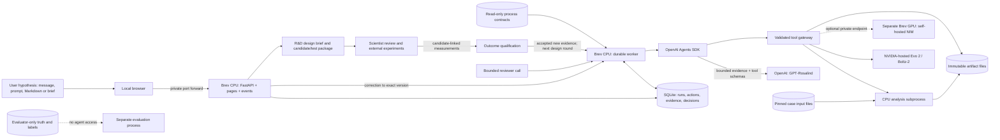
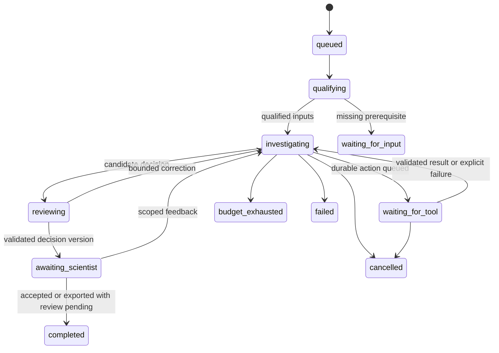

# Technical architecture

Version 0.3 · Proposed build specification

## Architecture decision

Use **OpenAI Agents SDK in our Python worker**, with the OpenAI Python client as its transport. The SDK owns each model/tool interaction loop. Our application owns cases, queued work, tool authority, durable state, scientific validation and artifacts. OpenAI's managed Agents API is a different runtime and is not a prerequisite. [Runtime comparison](https://developers.openai.com/api/docs/guides/agents)

Start with a coordinator and a separately invoked reviewer. Add specialist agents through bounded application calls or SDK agents-as-tools after the vertical slice passes. Do not implement an unrestricted network of agents handing control to one another. Keep final decision ownership with the coordinator and publication authority with deterministic application validation.



The local development profile runs the same API, worker and interfaces on the ARM64 Mac with a small input slice. Do not share a live SQLite file between the Mac and Brev or across a network filesystem. A deployment has one authoritative state directory.

## Components and boundaries

| Component | Concrete implementation | Responsibility |
| --- | --- | --- |
| API/UI | FastAPI, Jinja2, small browser JavaScript; localhost port 8080 | Case creation, run start, SSE status, evidence inspection, correction, export |
| Worker | One Python process, polling a SQLite job table with leases | Execute the state machine; no work depends on an HTTP request staying open |
| SDK integration | `agents.Agent`, `Runner`, `function_tool`, explicit model ID | Scientific reasoning and bounded review; no direct durable-state mutations by model text |
| Tool gateway | Pydantic/JSON Schema validation and allowlisted Python adapters | Resolve dataset IDs to allowed paths; enforce scope, cost, prerequisites and output validation |
| CPU executor | Fixed entrypoints in a subprocess/container | Source extraction, joins, sparse summaries, statistics and structure inspection |
| NIM executor | HTTP client plus one action record per logical computation | Submit, retain vendor job ID, poll when documented, validate and store outputs |
| State | SQLite WAL, foreign keys, application migrations | Run transitions, stable actions, attempts, events, immutable decisions and feedback |
| Artifacts | Content-addressed files beneath one runtime root | Atomic writes, SHA-256, MIME/size metadata, source/result/download references |
| Reference retrieval | SQLite FTS or manifest-indexed file excerpts | Read only approved case evidence and the applicable graph-contract subset |
| Evaluation | Separate process and input mount | Invariant checks, locked expected labels, human score sheets, mode comparisons |
| R&D handoff and return | Versioned briefs/candidates, comparison adapter, artifact export and outcome importer | Connect case evidence to modeled designs and return measured results to a new investigation round |

Choose a pinned Python 3.11 runtime for the new application. The current Brev system Python is 3.10.12 and the existing local prototype was tested with Python 3.13. Keep those historical environments intact; build and verify a separate environment/container. Resolve compatible package versions once, lock them, and test Linux x86_64 plus local macOS ARM64 dependencies. Container image digests and lock hashes go into the run manifest.

## Existing code migration

The implementation source currently lives at the local project root under `rosalind/`; it is not present as Python source on the inspected GitHub documentation branch. Copy reviewed source, tests, fixtures, licenses and vendor pins into the team's repository as the first implementation PR. Exclude virtual environments, caches, credentials, private data and run payloads.

| Existing module | Reuse | Required change |
| --- | --- | --- |
| `rosalind/core.py: Registry, Tool` | Tool definitions, routing validation, output schemas | Place behind typed wrappers; return bounded result envelopes and durable evidence IDs |
| `core.py: Question` | Scientific question/rationale contract | Replace mandatory patient identity with typed source scope; ALK assays have no patient |
| `core.py: Ledger` | Provenance/redaction conventions; JSONL export | SQLite becomes authoritative; fixed run/action IDs; single writer; crash-safe artifact commit |
| `nim.py: Config` | Explicit endpoint selection, auth separation | Per-tool backend/model config instead of one global mode for both services |
| `nim.py: Client` | Saved requests/responses and validation | Asynchronous accepted/pending state, reconciliation and stable attempt identity |
| `nim.py: evo2_score_snv` | Prefix-only score and tensor checks | Separate explicit hosted 7B forward backend, checked contract and model metadata |
| `nim.py: boltz2_compare_complex` | Matched pair and partial failure handling | Keep target WT/mutant route; add separate ALK ligand and candidate-binder comparison contracts; changing a binder is not a single target substitution |
| `workflow.py` | Offline regression fixtures and known routing examples | Retain as deterministic baseline; new SDK flow is separate from demo heuristics |
| `__main__.py: build` | Wiring reference | Replace per-call fresh run identity for resumable application work |

The existing depth/VAF cutoffs are demonstration routing heuristics. They must not become clinical acquisition criteria. The current `artifact()` creates files exclusively but does not implement the new atomic content-addressed commit protocol.

## Proposed repository layout

```text
packages/rosalind-bionemo/           existing prototype, tests, vendor notices
src/rosalind_harness/
  api.py                           routes and rendering
  worker.py                        run state transitions and leases
  agents.py                        coordinator/reviewer definitions
  model_capabilities.py            account-specific capability record
  contracts.py                     strict Pydantic records
  store.py                         SQLite transactions and migrations
  artifacts.py                     atomic writes and manifests
  policy.py                        scope, budgets and allowed actions
  tools/{catalog,tables,statistics,sequences,structures,nim,design}.py
  cases/{alk_atlas,bcma_gse164551,maynard_th266}.py
  prompts/{coordinator,reviewer,specialists}/
  templates/                       case, run, evidence and decision pages
config/{local,brev-cpu,replay}.yaml
casepacks/                         sanitized manifests and small fixtures
tests/{contracts,recovery,scientific_invariants,integration}/
eval/                              evaluator code; hidden data outside agent mount
deploy/{Dockerfile,compose.cpu.yaml}
docs/engineering/
```

## Execution flow and SDK integration

One application cycle performs one bounded scientific step. Long-running external jobs are persisted outside the SDK loop.

1. Intake accepts the user-supplied hypothesis from a message, prompt, selected Markdown/text file or structured brief. Pin its original content/provenance and extract a typed `HypothesisSpec`; clarify a missing or materially ambiguous objective. API validates the case manifest and stores the hypothesis ID/version, input identities, allowed tool families, immutable mode and budget.
2. Worker leases the next run, qualifies case inputs and builds a compact evidence packet.
3. Coordinator runs through `Runner.run` with an explicit model, typed context, narrow tools and a turn limit. The model can read accepted evidence, request an analysis, or return a typed step result.
4. A tool request crosses the gateway. Known case/run IDs, filesystem roots and endpoint origins come from trusted runtime context; the model cannot choose them.
5. For an expensive job, the gateway validates and transactionally queues the logical action. It returns a receipt. The worker ends/checkpoints the scientific step and enters `waiting_for_tool`; no repeated paid LLM polling.
6. The executor submits that action once, records its attempt/request ID and persists validated results. The worker starts the next SDK turn with the actual result and evidence references.
7. Once ready to decide, the coordinator drafts a typed decision. The reviewer receives the evidence snapshot plus draft in a separate call. It produces exact claim challenges and missing discriminators.
8. The coordinator revises once. A deterministic finalizer verifies every cited evidence ID, numerical locator, mode and unresolved limitation, then stores decision v1.
9. Scientific review/correction occurs as an application event. The corrected case starts a new bounded turn and produces v2; v1 remains immutable.
10. Export an evidence-linked R&D design brief. For an eligible design question, queue reference/candidate BioNeMo predictions through the same gateway and return the structures, comparison and test plan to R&D.
11. Qualify returned measurements against candidate/experiment IDs and enqueue a new investigation/design round. Preserve the original prediction and show the evidence-to-decision change. No active worker waits for laboratory completion.

Use **one conversation strategy** per agent: a persistent SDK SQLiteSession with an explicit file path, separate from operational state. An SDK session persists model history, not external job completion. Save resumable SDK run state if using SDK interruption features; resume that same state. Never combine full local history replay with `previous_response_id` for the same conversation. [SDK execution and continuation](https://developers.openai.com/api/docs/guides/agents/running-agents)

Conceptual integration shape, to implement after the capability probe:

```python
from agents import Agent, Runner, SQLiteSession

coordinator = Agent(
    name="Translational coordinator",
    model=settings.openai_model,  # gpt-rosalind-research, explicit
    instructions=prompts.coordinator,
    tools=case_tool_factory.for_case(case),
    output_type=InvestigationStep,  # enable only after model schema probe
)
result = await Runner.run(
    coordinator,
    next_turn_packet,
    context=trusted_run_context,
    session=SQLiteSession(session_id, settings.session_db_path),
    max_turns=4,
)
await application_finalizer.accept_step(result.final_output, trusted_run_context)
```

`InvestigationStep`, `case_tool_factory` and the finalizer are proposed application components, not SDK APIs. The finalizer uses stored state to determine whether execution is complete; an agent's final text alone cannot establish completion. If strict structured output is unsupported, use validated JSON with one bounded repair attempt and record that capability downgrade. Tool calling itself remains a launch gate.

Every tool wrapper calls the durable gateway, even read-only numerical tools. Move existing blocking requests and heavy calculations off the asyncio event loop. A coordinator's action proposal cannot directly insert an accepted scientific claim into the evidence table.

## Run, action and scientific states



There are three separate axes:

- Execution: run state above; action state `queued/submitting/pending/succeeded/failed/unknown/cancelled`.
- Scientific conclusion: `supported_within_scope/contradicted/unresolved/not_evaluable`.
- Review: `unreviewed/changes_requested/accepted`.

A completed export may have an unresolved conclusion and pending scientific review. A failed NIM job never becomes supporting evidence. Cancellation stops new actions immediately; an external job without cancellation support remains tracked and is labelled cancellation requested/external status pending.

The application, not model output, assigns IDs, versions, execution mode and review metadata. An immutable decision records `review_status_at_issue=unreviewed`. Current review disposition is a projection of feedback events for that exact decision version, exposed separately by the API. Accepting v1 does not automatically accept a later v2.

## Tool and data contracts

The machine-readable starting contracts are in [contracts](contracts/README.md). Important rules:

- A proposed `HypothesisSpec` records an application-assigned ID/version, original hypothesis text, interpreted statement, scope/constraints, source references and any superseded version. Each source has a kind (`message`, `prompt`, `markdown`, `text`, `structured_brief`), content artifact/hash, message or file identifier, and section/line locator when applicable. Multiple sources are allowed; ambiguous conflicts require clarification.
- Pin the hypothesis ID/version to the run, action rationale, decision and R&D brief. User amendments create a new version; ongoing runs retain the version they started with. Agent-derived subquestions and alternatives carry separate IDs, `origin=agent_derived` and a parent hypothesis reference. The conclusion may reject the supplied hypothesis without changing the recorded objective.
- User-designated hypothesis files are parsed as task input within the application's scope and tool policy. Retrieved papers, ordinary data files and embedded commands cannot redefine the task or expand tool authority. Parse/pin source content without executing it.
- An action identifies a hypothesis, question kind, rationale, exact input artifact IDs, expected discriminator and parameter object.
- A source context has `scope_kind`: functional assay, patient, model, reference or synthetic. Patient/sample requirements apply conditionally. Never fill a required field with a fabricated identifier.
- An evidence record distinguishes measurement, derived analysis, model prediction, literature interpretation and synthetic output.
- Artifact references use server-generated IDs and hashes. For tables, store worksheet/table/key/column/cell or a reproducible row-selection query.
- An output claim records evidence IDs, counterevidence IDs, limitations and the scope within which it holds.
- A model endpoint and model identity are trusted configuration. Retrieved instructions cannot supply endpoint URLs, shell commands or path roots.

## Persistence and recovery

Use the proposed [SQL schema](contracts/state-schema.sql) as the migration starting point. SQLite WAL permits the API and a single worker to coexist. Use foreign keys, short transactions, busy timeout and optimistic state versions.

Each action has a stable logical `action_id` and a unique key derived from run, tool contract version, canonical parameters, input hashes, backend/model and explicit replicate index. Reusing an identical request returns its existing receipt/result. A deliberate stochastic repeat must have a distinct replicate index; cache reuse must not erase uncertainty.

Execution protocol:

1. Transactionally record action intent and budget reservation.
2. Lease action; write attempt as `submitting`.
3. Submit request, capture request/job ID and observed status.
4. Store artifact bytes to a temporary file on the same filesystem, flush, hash and atomically rename.
5. Transactionally insert evidence, artifact references and checkpoint; release reservation against actual usage.

Crash handling:

| Failure window | Recovery |
| --- | --- |
| Before submission | Re-lease expired action; no external work yet |
| After submit with known vendor job ID | Reconcile/poll that job; do not submit another |
| After submit without a usable job ID | Mark unknown; require operator reconciliation or an explicit separately budgeted repeat |
| After artifact write, before DB commit | Reconcile by action/request metadata and hash; attach only validated results |
| After DB commit, before SDK history save | Read accepted evidence from DB; dedupe tool receipt by action key |
| During scientist review | Reload exact decision/feedback version and idempotency key |

A provider that offers no idempotency/reconciliation mechanism prevents an exactly-once external-call guarantee. The application can still prevent silent duplication and represent the uncertainty honestly. Pure reads can retry transient failures up to three times with backoff; schema/auth/invalid-reference failures are not retryable. SDK/client retry settings must not multiply application retries unnoticed.

## API surface

| Method/path | Contract |
| --- | --- |
| POST /v1/cases | Validated case manifest plus supplied hypothesis/source references → case ID, hypothesis ID/version, readiness state, missing requirements |
| POST /v1/cases/{case_id}/runs | Hypothesis ID/version, mode, bounded budget, scoped investigation question, idempotency key → run ID; HTTP 202 means queued |
| GET /v1/runs/{run_id} | Execution/scientific/review states, progress, usage, pending action |
| GET /v1/runs/{run_id}/events | SSE with increasing event IDs; reconnect using Last-Event-ID |
| POST /v1/runs/{run_id}/cancel | Idempotent cancellation request; report external in-flight status separately |
| GET /v1/runs/{run_id}/evidence | Filtered evidence records and artifact IDs |
| GET /v1/artifacts/{artifact_id} | Authorized, bounded download; never arbitrary filesystem read |
| GET /v1/runs/{run_id}/decisions/{version} | Immutable typed decision and rendered brief |
| POST /v1/runs/{run_id}/feedback | Target version/claim, correction, reviewer identity, idempotency key |
| POST /v1/runs/{run_id}/design-briefs | Evidence-linked objective, reference, constraints and test plan → versioned R&D brief; W20 |
| POST /v1/design-briefs/{brief_id}/comparisons | Qualified candidate/control IDs and prediction specification → durable action receipt; W21 |
| POST /v1/design-briefs/{brief_id}/outcomes | Candidate/experiment-linked measurements and artifacts → qualification receipt and next-round status; W18 |
| GET /v1/runs/{run_id}/export | Manifest + decision + selected evidence/artifacts; respect export permissions |
| GET /health/ready | DB schema, writable output root, input mount and capability status; no inference |

Use 409 for stale versions/idempotency conflicts, 422 for invalid inputs, and typed errors for unavailable capabilities. No public multi-tenant service is assumed. Bind to loopback and use Brev forwarding for the first release; a shared/public deployment needs authentication and scoped dataset access before exposure.

## Feedback, graph and future specialists

Preserve the existing four loops: more analysis (L1), correction of the case (L2), intake of new measurements (L3), and evaluated procedural transfer (L4). P0 implements L1/L2 and the explicit R&D handoff. P1 connects candidate structural modeling and measured-outcome intake into L3; evaluated cross-case transfer remains P2.

The [R&D feedback specification](07-RD-FEEDBACK-LOOP.md) defines the CAR-T branch and proposed `DesignBrief`, `DesignCandidate`, `ExperimentOutcome` and `DesignIteration` records. Add versioned schemas and migrations in W20/W21/W18; the starting SQL/JSON files do not yet implement these extensions. `awaiting_experiment` is a persisted design status, separate from an active run. A new accepted outcome creates evidence and a new bounded run, rather than keeping an SDK call open or overwriting the old prediction.

Read the pinned process-graph extract to choose appropriate checks and roles. Do not require a running Neo4j service or infer authority from a graph edge. The local graph location is recorded in the source audit; the portable extract can be copied into a case's contract bundle.

For P1, give bioinformatics, quantitative, clinical/pharmacology and molecular/assay specialists their own evidence subset and bounded output contract. Their briefs include claims, counterevidence, missing information and one proposed discriminator. Allow at most one challenge round. Two agents repeating the same paper count as one evidence source.

Lessons are candidate records until a reviewer and disjoint evaluation approve a release. Case correction is immediately useful without activating global memory. A run pins its memory release; suspension flags affected decisions and preserves prior releases.
