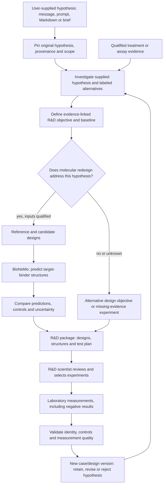

# R&D feedback loop — CAR-T worked example

Version 0.3 · Build specification · 19 September 2026

## Product outcome

**The hypothesis to investigate comes from the user: a direct message, a prompt, a selected Markdown/text file, a structured brief, or a combination of inputs.** The agent records the original hypothesis and provenance, interprets its scope, and investigates it against the available evidence. Agent-proposed alternatives, subquestions and follow-on designs remain labeled and linked to that starting hypothesis. The [hypothesis template](contracts/hypothesis-template.md) provides an optional file-based input.

**One output of that investigation is a modeled therapy-design proposal that goes back into R&D.** Within the supplied objective, the workflow connects treatment or assay evidence to a proposed improvement, uses NVIDIA BioNeMo for appropriate molecular predictions, and returns an experiment-ready research package. Measurements from those experiments then inform the next investigation and design round.

For CAR-T, the concrete modeling output is a predicted structure of a candidate antigen-binding domain in complex with its target, compared with the reference binder under matched conditions. The package explains why the candidate could address the observed failure and what R&D must measure to establish an improvement. This is structural prediction of a component/interface, not simulation of a whole CAR-T cell, immune system or patient response. Molecular dynamics and whole-cell simulation are not part of this implementation.

This is the feedback connection the product is intended to provide; it is not a claim that all existing R&D organizations lack such a process. The specification adds a required R&D handoff to P0 and a structural-comparison/measurement-return milestone to P1. No candidate structures or experimental results were generated while writing this plan.

## The process

GPT-Rosalind, through the OpenAI Agents SDK, investigates the supplied hypothesis, interprets accepted evidence, proposes designs within that objective and explains the comparison. Typed application tools prepare inputs, request BioNeMo predictions, calculate reproducible comparisons and validate returned measurements. The model does not mark its own design as experimentally successful. If the starting hypothesis is missing or material ambiguity remains, clarify it before dependent investigation; routine analysis does not require reconfirming an already clear objective.

## Worked CAR-T branch

Start from a user-supplied hypothesis about target recognition or escape, together with available observations. An illustrative input is: “Investigate whether the supplied candidate CAR binding domain could improve recognition of this retained target relative to the supplied reference, and identify the evidence and experiments needed to test that claim.” This is a template proposition, not a finding or a hypothesis already supplied for a live run. Define “better” before modeling: for example, improved measured recognition of a retained target state relative to a specified reference, while preserving an agreed specificity requirement. Record the endpoint, assay context, comparator and acceptance rule. A larger structure-confidence score is not the improvement objective.

| Evidence state | R&D action | Modeling boundary |
| --- | --- | --- |
| Target is retained; a binding/interface hypothesis is supported enough to test | Compare the existing antigen-binding domain with an expert-provided candidate against the same target construct | Predict molecular structures; test binding and CAR function separately |
| Target loss is supported | Produce an alternative-antigen or multi-target research brief and evidence requirements | Improving binding to an absent antigen does not address that failure; do not fabricate a same-target rescue |
| Target protein abundance, identity or mechanism is uncertain | Ask for a discriminating measurement in the R&D package | RNA alone does not establish accessible surface protein; delay dependent design claims |
| Evidence points to a cell-state or signaling limitation | Route to a relevant functional research objective | Binder structural modeling alone cannot establish a solution |

The prepared BCMA case is useful for the antigen-loss routing check. It is not automatically a suitable positive example of binder redesign. Use a separately qualified target-retained CAR-T scenario for the structural comparison, with its own manifest and provenance. Keep hypothetical example data visibly separate from observations in the BCMA patient.

For the first eligible comparison, take one identified reference binder and one expert-provided candidate. Declare the exact molecular format: an scFv with its linker, another antibody fragment with its actual chains, or a different binding scaffold. Preserve construct boundaries, chain identities, target sequence and residue mapping. Do not treat an arbitrary de novo binder as a validated CAR-compatible scFv.

## BioNeMo execution

1. **Qualify inputs on CPU.** Resolve approved sequence/structure artifacts, target construct, reference and candidate IDs, format, relevant modifications, provenance and a versioned prediction specification. Record omitted membrane context, glycosylation or other relevant structural context as limitations. Missing critical inputs block submission.
2. **Predict matched complexes.** Send reference/target and candidate/target protein-complex requests through a new `compare_binder_candidates` adapter using Boltz-2. Use matched model, backend and inference settings; record any supported stochastic-repeat identifiers. The documented Boltz NIM accepts protein polymers and returns structural artifacts; the actual deployed response contract must pass the capability probe. [NVIDIA Boltz-2 inference contract](https://docs.nvidia.com/nim/bionemo/boltz2/1.6.0/inference.html)
3. **Inspect results deterministically.** Validate chains and residue counts, retain the returned mmCIF files and raw confidence output, and summarize interface contacts/clashes with versioned definitions. Report ipTM, pLDDT or other named metrics only when the endpoint actually returns them with known meanings. Record unavailable metrics as missing. These predictions do not measure affinity, specificity, cytotoxicity or clinical benefit; the small-molecule affinity option is not a protein-binder affinity estimator.
4. **Compare controls and candidates.** Use a reference with documented experimental behavior and, where available, a qualified nonbinding reference. Predeclare the model-comparison rules and distinguish exploratory ranking from experimental acceptance. Preserve all evaluated candidates, failures and exclusions. If the prediction does not distinguish controls, report that lack of discrimination rather than using it to rank a winner.
5. **Return a research recommendation.** Produce a ranked or explicitly unrankable comparison with reasons, counterevidence and proposed tests. A valid outcome can be “no supported improvement” or “model is uninformative.” R&D chooses what to test.

Start with provided candidates to make the first comparison buildable. A later generation stage can use RFdiffusion for candidate backbones and ProteinMPNN for sequences, followed by independent complex evaluation. NVIDIA documents that general binder-design composition; applying it to a CAR requires explicit scaffold, epitope and construct constraints plus scientific review. It is a separate extension, not an already implemented scFv optimizer. [NVIDIA binder-design workflow](https://developer.nvidia.com/blog/accelerate-protein-engineering-with-the-nvidia-bionemo-blueprint-for-generative-protein-binder-design/)

The initial four-request NIM budget is shared across an investigation. A standalone design round with one reference, one candidate and one nonbinding control uses three structure requests. Reserve that budget before dispatch. If earlier analyses, repeats or matched target-variant comparisons require more, create a separately budgeted design round; do not hide those requests inside one tool call. Model settings and controls must remain comparable within each comparison.

## What R&D receives

These are proposed export artifacts, created by the implementation when a design round runs:

| Artifact | Required content |
| --- | --- |
| `rd-brief.md` | Original user-supplied hypothesis and source/version, interpreted scope, observed problem, linked evidence, labeled alternatives, improvement objective, reference, design rationale, limitations and scientific review status |
| `candidates.csv` | Candidate/parent IDs, exact construct artifact/hash, target ID, hypothesis ID, eligibility, available prediction metrics, disposition and exclusion reasons |
| `structures/` | Reference/candidate/control mmCIF files, exact request/response artifacts and model/version provenance; missing or failed outputs explicitly listed |
| `comparison.json` | Matched comparison specification, tool action IDs, measures with definitions, uncertainty, control behavior and whether the model changed the design decision |
| `experiment-plan.md` | Candidate-specific tests, comparator/controls, units, independent experimental unit, prespecified acceptance criteria and expected positive/negative/inconclusive interpretations |
| `outcome-template.csv` | Required fields for R&D to return measurements against the same candidate and experiment IDs |
| `manifest.json` | Case/decision/design-brief versions, mode, hashes, lineage, tool/model versions, reviewer and full output inventory |

The CAR-T experiment plan covers the relevant binding comparison, target-present/target-absent specificity controls, functional cell-response endpoints and construct expression/developability checks. R&D selects the appropriate assays and criteria. A binding result alone cannot mark the full therapy as improved. This document specifies the handoff and measured endpoints, not a laboratory protocol.

## Measurement return and next iteration

Add the following versioned application records. These extend the [starting contracts](contracts/README.md); they are not implemented by the current JSON/SQL files.

| Record | Minimum fields |
| --- | --- |
| `DesignBrief` | ID/version, case/decision version, supplied hypothesis ID/version and evidence IDs, labeled derived-hypothesis links, target/reference IDs, objective, constraints, assay acceptance specification, parent brief, review status |
| `DesignCandidate` | ID, brief version, parent candidate, construct artifacts/hashes, origin (`expert_provided` or recorded generation action), target, prediction action IDs, disposition |
| `ExperimentOutcome` | ID, experiment/candidate/brief IDs, assay/sample context, comparator/control IDs, endpoint, value/unit or failure reason, replicate identity, raw-data artifact/hash, QC, observed time, submitter, immutable mode |
| `DesignIteration` | Parent/new brief versions, accepted outcome/evidence IDs, resulting decision, rationale, changed constraints and next proposed action |

Use `POST /v1/runs/{run_id}/design-briefs` to store a versioned brief, `POST /v1/design-briefs/{brief_id}/comparisons` to queue a validated prediction action, and `POST /v1/design-briefs/{brief_id}/outcomes` to ingest returned measurements. Requests include idempotency keys and expected versions. IDs, scope, review identity and durable state come from the application; model text cannot supply authority.

The outcome importer checks identity, units, replicate structure, controls and source hashes before creating accepted evidence. Invalid records remain visible as rejected or awaiting clarification. Failed experiments, null results and adverse tradeoffs remain first-class outcomes; missing measurements never become zeros. A synthetic or replayed outcome cannot become live experimental evidence.

After intake, start a new bounded investigation/design round referencing the supplied hypothesis/version, original prediction and accepted new evidence. Preserve the old decision and prediction. Show an explicit delta: which hypothesis gained or lost support, whether the candidate met the prespecified endpoint, and whether the next step is another design, an alternative mechanism, or more measurement. New evidence can refute the hypothesis; it cannot silently replace the user's research objective. A user amendment creates a new linked hypothesis version. Do not automatically retrain model weights or activate cross-case memory from one experiment.

An exported package may remain `awaiting_experiment` for days. This is a persisted design status; no worker slot or active SDK conversation waits for the laboratory. Outcome intake enqueues the next run when data arrive.

## Build placement and definition of done

Run the design brief, input preparation, HTTP adapters, comparison calculations, state and exports on the existing Brev CPU or the local development profile. GPU structure inference runs behind hosted BioNeMo NIM endpoints. A separate Brev GPU deployment is optional, subject to verified hardware and endpoint contracts. No GPU is assumed on the CPU Brev machine or Mac.

Implement `tools/design.py` plus `tools/nim.py` adapters, application records/migrations, a compact R&D section in the existing UI and CSV/JSON outcome import. Reuse the durable action queue, evidence store, budgets and recovery rules. The existing single-substitution target WT/mutant adapter is not the candidate-binder comparison contract: this branch changes the binder while holding the qualified target fixed.

- **P0, W20:** every selected investigation exports an evidence-linked R&D brief and return-data requirements, including a precise block when design inputs are missing.
- **P1, W21:** a qualified reference/candidate/control set produces accepted structural artifacts and an interpretable or explicitly uninformative comparison. No claim of a better therapy is inferred from prediction confidence.
- **P1, W18:** returned measurements attach to the exact candidate/version, pass qualification and generate a traceable next-round decision. A labeled fixture can establish software behavior; only actual measurements establish experimental findings.

The feedback-loop milestone is complete when an engineer can trace **user-supplied hypothesis → evidence/investigation → design objective → candidate structure → R&D test → returned outcome → updated assessment and next decision** without losing identity, provenance or uncertainty. A structure image alone, a static report with no return path, or an untested “better CAR-T” claim does not meet that requirement.
