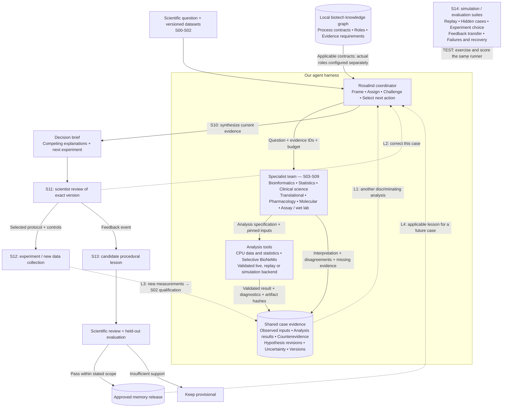
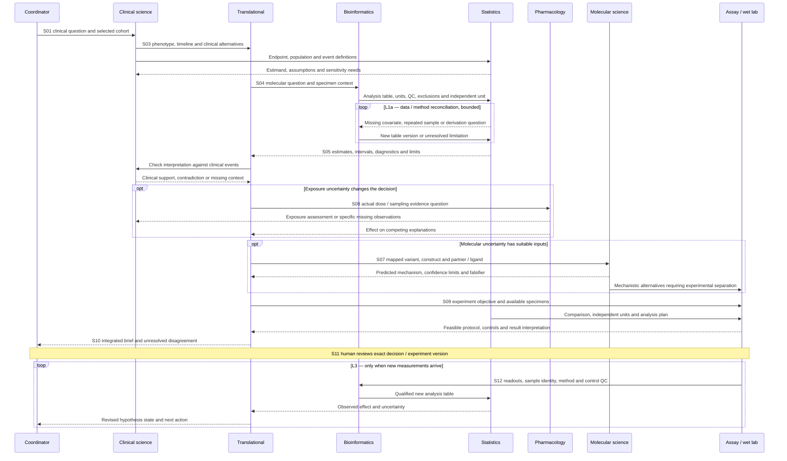

# Agentic translational scientist — reference architecture

Version 0.1 · 19 September 2026 · Proposed design with audited local inputs

This architecture implements the agreed flow: a coordinator frames a scientific question, specialists exchange reviewable work products, tools produce evidence, and a scientist reviews the resulting decision and next experiment. Four explicit loops cover additional analysis, case correction, new experiments and transfer of learned procedures.

The architecture supports separate case packs: ALK resistance, CD20/CD19/BCMA escape, and clinical biomarker association. They share contracts and runtime behavior. They do not share a fabricated patient population or require every available dataset/tool.

**Companion:** `DATA-AND-TOOLS.md` defines D00–D18 dataset packages, T01–T17 tools, source links, local paths, readiness boundaries and potential downloads. `local-asset-audit.csv` contains the selected-file integrity snapshot. `architecture.mmd` is the editable overview diagram.

## 1. Reference flow — preserving the original graph

Solid arrows carry requested work, evidence or a release. Dashed arrows labeled L1–L4 return to earlier work. The evaluation connection is explicitly labeled TEST, not a scientific feedback loop.

| Loop | Trigger and path | Stop condition |
| --- | --- | --- |
| **L1: investigation** | Evidence exposes a resolvable uncertainty → coordinator → appropriate specialist/analysis → checked result → revised hypothesis | Decision sufficiently supported, no feasible discriminator, new data required, or budget reached |
| **L2: case correction** | Scientist targets a claim/decision version → correction → new decision version → review as needed | Correction addressed or disagreement explicitly retained |
| **L3: experimental learning** | Selected experiment → new measurements and controls → qualification → analysis → revised decision | Result interpreted within assay scope; another experiment requires a new justified selection |
| **L4: cross-case learning** | Feedback → bounded candidate lesson → review + disjoint evaluation → release → scoped retrieval in another case | Unsupported lesson stays provisional; contradictions can suspend/supersede it |

S03/S04 can begin independently after the relevant inputs pass S02. S05 depends on an accepted analysis table and clinical definition. S07/S08 are conditional branches, not compulsory serial steps. Loops do not repeat merely to manufacture consensus.

## 2. Runtime and implementation boundary

Proposed initial deployment: one Python API, one durable case worker, a SQLite transaction store and immutable artifact files; tool adapters execute local CPU jobs or submit external computations. Model-generated actions are proposals checked by the worker. The coordinator cannot directly mutate the evidence store or activate its own lesson.

Keep four stores logically separate:

1. **Reference contracts:** a pinned read-only biotech graph release/snapshot, D00.
2. **Operational case state:** runs, actions, evidence, hypotheses, decisions and reviews.
3. **Approved memory:** immutable lesson versions and release manifests.
4. **Evaluation truth:** hidden scenarios, withheld outcomes and scoring rules, inaccessible to agent retrieval and tool workspaces.

The current prototype has schema-validated tools, routing checks, evidence events and hashed artifacts in `rosalind/rosalind/core.py`; `workflow.py` is a deterministic synthetic target-escape workflow. Its Evo 2 and protein-complex Boltz adapters are useful starting points. A durable LLM coordinator, patient-table ingestion, general statistical workflows, ALK ligand support, scientist-feedback service and transfer evaluation remain proposed. The implementation record reports prior offline/loopback tests; this documentation task did not rerun them or establish live inference.

GPT-Rosalind is the intended reasoning option where the account has access. Record the actual model and configuration used. A local package named `rosalind`, installed skills or Workbench availability do not themselves establish model access. See T01 and the [official OpenAI guidance](https://learn.chatgpt.com/use-cases/collections/life-sciences).

## 3. Step-by-step data and tool contracts

Each step produces a typed artifact/event even when it is blocked or inapplicable. Data references identify packages to select from; they are not instructions to combine all packages. All outputs are proposed generated datasets unless identified as existing source files.

### S00 — open the case and freeze its scope

- **Owner:** coordinator; a scientist supplies the research objective.
- **Data:** D00; one selected case pack from D01–D17; available reviewer and compute configuration.
- **Tools:** T01, T02, T15.
- **Task:** record target/disease/treatment, question type, intended use, endpoint, evidence cutoff, input hashes, graph snapshot, memory release and limits. Choose live, replay or simulation mode before work starts.
- **Output:** `case_manifest.json`, with model/tool versions, allowed actions and a concrete completion condition.
- **Gate:** no hidden cohort substitution; missing scientific identifiers remain unresolved. Binding controls come from application configuration, not retrieved text.

### S01 — frame the clinical and biological questions

- **Owner:** clinical scientist → translational scientist; statistician consulted on the estimand.
- **Data:** D02/D03 for an ALK investigation; D04/D05 for antigen escape; D07 or D17 for a distinct response/association case. D13 supplies trial context only. D00 supplies interpretation boundaries.
- **Tools:** T01, T14 when reference lookup is needed.
- **Analysis:** define observed phenotype, population, time window, relevant comparison and competing explanations. Separate association, mechanism and prediction questions.
- **Output:** `question_contract.json`, initial `hypotheses.json` and required-data checklist.
- **Gate:** “Why did this patient progress?” cannot be answered as a patient-specific claim from functional atlas data alone.

### S02 — qualify sources, identities and joins

- **Owner:** bioinformatician/data steward, with clinical timing adjudication.
- **Data:** selected original files, their manifests, D16 overlap/sample index, assay dictionaries and specimen metadata. D18 for later experimental returns.
- **Tools:** T02, T03; Sequence Viewer where sequence mapping is involved.
- **Analysis:** verify bytes and format, patient/sample/assay identity, join cardinality, specimen/timepoint, measurement units, allowed use, reference build and missingness. Compare parent/child accessions before counting independent evidence.
- **Output:** `dataset_manifest.json`, `subjects.parquet`, `samples.parquet`, `assays.parquet`, `join_report.json`, `exclusions.tsv`.
- **Gate:** partial/corrupt bytes are rejected; a failed timing or identity check routes back for correction. No downstream model turns a missing baseline label into a guessed baseline.

### S03 — reconstruct the clinical timeline

- **Owner:** clinical scientist → translational scientist and statistician.
- **Data:** D02 treatment-state metadata; D03 mutation timing categories where supplied; selected cohort clinical supplements. For biomarker cases, D07/D17 actual outcome/arm tables. D12 is supporting pharmacology context.
- **Tools:** T03, T13 for deterministic event/time checks, T01 for interpretation.
- **Analysis:** align biopsy, therapy, response and progression; distinguish treatment-naive, residual and progressive states; record dose/exposure gaps. Preserve censoring and event definitions for survival work.
- **Output:** `clinical_events.parquet`, `eligibility_report.json`, `clinical_context.json` with patient-specific unknowns.
- **Gate:** D03 cBioPortal repeat samples cannot be declared baseline/progression without timing. Drug-label instructions cannot be substituted for administered dose.

### S04 — derive biological features and QC evidence

- **Owner:** bioinformatician → statistician.
- **Data:** D02 expression/cell mapping; D04 gene counts; D05 mutation/metadata files; D06 construct/isoform tables; D07 microarray/RPPA; D09 protein perturbation; selected D15 objects after availability checks. D11 for pathway annotation.
- **Tools:** T03–T05; T12 only when selected raw reads are needed; T14 for exact gene/transcript references.
- **Analysis:** select the modality-appropriate branch: count QC and normalization, single-cell annotation/aggregation, variant normalization, isoform quantification, microarray processing or RPPA normalization. Separate feature extraction from inference.
- **Output:** `analysis_table.parquet`, `feature_dictionary.json`, `qc_report.json`, assay-scale and transformation records, sample exclusions.
- **Gate:** gene counts do not establish splice usage; a processed RDS is not assumed to contain raw counts; microarray intensities are not RNA-seq counts; a missing expression matrix cannot be reconstructed from cell metadata.

### S05 — quantify the evidence statistically

- **Owner:** statistician ↔ bioinformatician; clinical scientist owns endpoint meaning.
- **Data:** accepted S04 table, S03 population/timeline, prespecified comparison and covariates; D01/D06 experimental labels only in the appropriate training/evaluation partition.
- **Tools:** T04–T06, with T02 provenance. Numerical computation is performed by analysis functions, not by prose generation.
- **Analysis:** appropriate paired/longitudinal or donor-level comparison; effect estimates, intervals, design diagnostics, multiplicity, missingness and sensitivity checks. PRINCE can use a survival branch only after time/event validation; I-SPY2 follows its verified released endpoint.
- **Output:** `analysis_spec.json`, `estimates.parquet`, `diagnostics.json`, plots and a result-status record including failed fits.
- **Gate:** independent unit declared; actual sample/event counts reported; model assumptions assessed. Return confounded, missing or inconsistent inputs to S04/S03. A significant estimate in one group and nonsignificant estimate in another is not itself a tested interaction.

### S06 — integrate clinical and molecular alternatives

- **Owner:** translational scientist → coordinator; challenges routed to the relevant function.
- **Data:** S03–S05 outputs; D01 functional evidence, D08 cell-line context and D11 pathways if relevant; exact source literature via T14.
- **Tools:** T01, T14, T15.
- **Analysis:** construct a claim-to-evidence matrix. For each explanation record predictions, supporting evidence, counterevidence, uncertainty and a feasible discriminator. Distinguish repeated analyses of one source from independent support.
- **Output:** `hypothesis_revision.json`, `evidence_matrix.parquet`, `next_action_candidates.json`.
- **Gate:** computational predictions, assay measurements and clinical observations retain their different evidence types. Route to S07, S08, S09, another S04/S05 analysis, or an unresolved S10 brief according to the actual gap.

### S07 — investigate a molecular mechanism, when relevant

- **Owner:** molecular/structural scientist → translational and assay scientists.
- **Data:** verified variant plus D10 exact sequence/construct/partner/ligand package; D01 or D06 measured-label context when permitted. Genome-to-transcript-to-protein mapping is a prerequisite.
- **Tools:** T07 Evo 2 for a DNA sequence question; T08 Boltz-2 for a justified complex; optional T09 DiffDock for a small-molecule pose question; optional T10 for a distinct folding/MSA need; T11 for structural inspection.
- **Analysis:** compare matched reference/mutant inputs with consistent settings; inspect coverage, confidence, chain identity, mapping and model limitations. Protein–binder and kinase–small-molecule routes have distinct contracts.
- **Output:** request/response artifacts, sequence score or paired structures, structural review and experiment discriminators.
- **Gate:** no sequence score, docking confidence or predicted affinity automatically becomes resistance probability or causal validation. The existing Boltz adapter needs extension for the ALK ligand route. If exact mapping or service readiness is absent, record the missing prerequisite.

### S08 — assess exposure and pharmacology, when relevant

- **Owner:** clinical pharmacologist ↔ clinical scientist; results to translational.
- **Data:** actual patient dosing, concentration/sampling and covariate records; S03 timeline; D12 labels as reference context. These patient-level measurements may require potential acquisition.
- **Tools:** T03/T13, T06 when an exposure model is justified; T01 for synthesis.
- **Analysis:** actual versus nominal times, units, interruptions, below-quantification observations and exposure plausibility; fit PK/PD only where inputs and design support it.
- **Output:** `exposure_assessment.json`, model/diagnostic artifacts if fitted, unresolved data request if not.
- **Gate:** lack of exposure data keeps the explanation open. This branch does not generate a dose recommendation from model output alone.

### S09 — select the next discriminating analysis or experiment

- **Owner:** translational + assay/wet-lab scientist; statistician specifies comparison and uncertainty needs.
- **Data:** S06–S08 hypotheses, D08 model-selection context, assay specifications, specimen availability and D18 planned experiment records.
- **Tools:** T01, T06 for design calculations where assumptions exist, T15 to preserve the protocol; T16 supplies only explicitly synthetic experiment responses in simulation mode.
- **Analysis:** compare feasible actions by which hypotheses they distinguish, controls, independent replicates, expected observations, cost/time assumptions and failure interpretations. Examples: orthogonal variant confirmation, matched functional dose-response, RNA/protein comparison, or isoform validation. The clinical-association pack uses interaction, adjustment or stability analyses instead.
- **Output:** `experiment_spec.json` or `followup_analysis_spec.json`; predefined result-to-hypothesis update rules.
- **Gate:** no universal assay or replicate count is invented. An analysis of existing data returns through L1; an external experiment proceeds to scientist review and L3.

### S10 — issue the evidence-linked decision draft

- **Owner:** coordinator integrating specialist positions.
- **Data:** all accepted case evidence, rejected/failed analyses, unresolved alternatives and the selected next action.
- **Tools:** T01, T02, T15; automated claim/reference checks before rendering.
- **Analysis:** reconcile numbers to actual results, distinguish observation from inference and preserve dissent. State what would change the recommendation.
- **Output:** immutable `decision_vN.json` and `decision_vN.md`, including evidence IDs, uncertainty, falsifiers and stop reason.
- **Gate:** every consequential empirical claim resolves to a result/source version. “Unresolved; new data needed” is a valid scientific outcome, distinct from an execution failure.

### S11 — obtain scientist disposition and correct the case

- **Owner:** configured scientific reviewer; coordinator applies the correction.
- **Data:** exact S10 decision, source artifacts, assay limits and reviewer role/scope.
- **Tools:** T15 review interface and T17 feedback capture.
- **Analysis:** accept within scope, return a claim for correction, request evidence or retain disagreement. A simulated reviewer is used only for workflow tests and is labeled as such.
- **Output:** `review_event.json` linked to `decision_version_id`; L2 produces a new decision version without overwriting the original.
- **Gate:** the local graph's proposed functional authority is not an actual appointment. Exploratory scientific acceptance does not authorize treatment or downstream regulated action.

### S12 — receive new measurements and reopen the investigation

- **Owner:** assay/wet-lab function → bioinformatics → statistics → translational.
- **Data:** D18 raw readouts, protocol/sample/control records and uncertainty; or newly acquired D01–D17 source versions.
- **Tools:** T03 for intake; T04–T06 as appropriate; T02/T15 for linkage.
- **Analysis:** first rerun S02 qualification, then attach results to the original experiment and prediction. Evaluate both positive and negative results under the predefined interpretation rules.
- **Output:** `outcome_event.json` and a new evidence snapshot; L3 returns to S04/S05/S06.
- **Gate:** a new measurement does not rewrite the original prediction. Delayed, missing, failed or QC-rejected results remain explicit states.

### S13 — curate and release a transferable lesson

- **Owner:** memory curator proposes; scientist and evaluation owner assess; configured release owner activates.
- **Data:** D18 feedback linked to exact decisions, supporting/contradicting episodes, independently partitioned cases and scope exclusions.
- **Tools:** T17, T16, T15; T01 may draft the candidate.
- **Analysis:** extract a conditional procedure, identify counterexamples, compare decisions with/without it, and assess out-of-scope application. Corrections to one case do not establish universal biology.
- **Output:** `lesson_vN.json`; evaluation results; immutable `memory_release.json` only if promotion criteria pass.
- **Gate:** missing review/evaluation keeps the lesson provisional. Freeze a release per run; record retrieved/applied/rejected lesson versions. L4 applies only to a subsequent appropriately scoped case.

### S14 — run simulation and evaluation around the whole process

- **Owner:** evaluation runner outside the agent's context; blinded scientists assess scientific decision quality.
- **Data:** frozen real-case partitions from selected D packages, synthetic hidden-world fixtures, recorded tool results, fault schedules and expected invariants. Public known labels may already be in model pretraining; document that limitation.
- **Tools:** T16 plus the same T02 execution and result contracts; T17 for memory conditions.
- **Analysis:** evidence replay, hidden-case ambiguity, next-experiment quality, feedback transfer, and timeout/restart/duplicate-action behavior. Use paired comparisons and matched model/tool budgets.
- **Output:** `evaluation_manifest.json`, per-case event traces, deterministic check results, scientist scores, cost/latency and regression report.
- **Gate:** distinguish a few demonstration cases from a powered evaluation. Never promote simulated truth into a biological finding or put holdout labels into the evidence graph.

## 4. Roles acting in the graph: handoffs and returns

| Sender → recipient | Payload required | Recipient acceptance / return route |
| --- | --- | --- |
| Bioinformatics → statistics | `analysis_table_id`, source hashes, patient/sample/assay namespaces, independent unit, feature scale, transformations, missingness, exclusions, batch/pairing fields | Check analysis unit and design estimability; return unsupported derivations or ambiguous joins to bioinformatics |
| Statistics → bioinformatics | Exact discrepancy, affected variables/rows, requested derivation, reason it changes inference | Return a new dataset version with change log or a justified refusal; no silent editing of the tested table |
| Clinical science → translational | Population, therapy/event timeline, phenotype, exposure gaps, disease/site context | Check that mechanisms address the same phenotype and time window; request missing clinical context |
| Clinical science ↔ statistics | Clinical question and endpoint meaning ↔ estimand, identification assumptions and sensitivity requirements | Existing two-way reference exchange; preserve clinical and statistical interpretations separately |
| Translational → pharmacology | Hypotheses potentially explained by exposure, actual dose/sample evidence references | Return assessed exposure and uncertainty; label-only data trigger a specific data request |
| Translational → molecular | Variant mapping, construct, exact therapeutic partner/ligand, competing mechanisms | Reject wrong reference/partner or irrelevant model route; return model-limited evidence and a falsifier |
| Translational/statistics → assay team | Discriminating objective, predicted result patterns, proposed comparison, specimen and assay constraints | Return feasible controls/readouts and independent-unit plan; revise an experiment that cannot separate explanations |
| Assay team → bioinformatics/statistics | Raw/readout files, method/sample/control versions, replicate structure, failed/QC-excluded measurements | Qualify before analysing; preserve negative, missing and failed results |
| Clinical/translational → other functions | Controlled interpretation version, audience/purpose, evidence and scope | Regulatory, safety or medical-affairs handoffs are conditional downstream work. Their decisions and permissions remain separate from this research harness |

Bioinformatics, molecular and wet-lab agent roles are proposed project roles; do not imply they already exist as exact role nodes in the local graph. The inspected graph explicitly includes clinical scientist, biostatistician, translational medicine lead, clinical pharmacology lead and biomarker/bioanalytical lead.

## 5. Graph mappings to reuse

| Architecture responsibility | Verified graph IDs | Implementation meaning |
| --- | --- | --- |
| Case scope, integration, challenge and disposition | `proc.clinical_interpretation`, its four detailed activities | Reuse the scope → integration → alternatives → qualified interpretation sequence |
| Data validity and reconciliation | `proc.data_review`, `analysis.data_quality`, `analysis.reconciliation` | Turn applicable contract clauses into explicit checks; absent applicable data remain unresolved |
| Assay/context fitness | `proc.biomarker`, `analysis.assay` | Attach method/specimen/context-of-use and interpretation limits |
| Statistical specification | `proc.sap`, `analysis.estimand`; `role.biostatistician` | Pin analysis specification and endpoint meaning; adapt scope for exploratory research |
| Exposure analysis | `proc.pharmacometrics`, `analysis.pkpd`; `role.clinical_pharm` | Require actual dosing/sampling and model diagnostics where exposure is assessed |
| Claim/output verification | `analysis.evidence`, `analysis.output_qc` | Reconcile numerical claims, exact sources, uncertainty and counterevidence |
| Scientific disposition | `decision.clinical_interpretation`, `artifact.clinical_interpretation` | Link review to exact memo version; configure the actual reviewer |

Reference `CONSUMES` edges point from a consumer to required information; they do not indicate execution order. `DECIDES` identifies proposed authority; it is not a performed approval. Runtime request/result edges in this architecture are separate operational relations.

## 6. Generated datasets and minimum record contracts

| Record | Grain | Required fields |
| --- | --- | --- |
| `subjects` | One subject within one source namespace | `study_id`, `subject_id`, eligibility, relevant clinical covariates and provenance |
| `samples` | One specimen/timepoint | `sample_id`, `subject_id`, collection time/state, tissue/site, permitted-use/source reference |
| `assays` | One assay of one sample | `assay_id`, `sample_id`, method/version, batch, scale/units, reference build, QC state |
| `analysis_table` | Declared independent analysis unit and feature | Unit ID, feature/value, context/time, covariates, input versions and exclusions |
| `analysis_spec` | One planned analysis version | Question/hypotheses, input references, model/contrast, transformation, missingness/multiplicity, diagnostics, seed and stop rules |
| `action_attempt` | One attempt at a stable logical action | Action/attempt/run IDs, request hash, status, external job ID, timestamps, observed error/result |
| `evidence` | One attributable observation/result | Origin and evidence type, action/source IDs, artifact hash, scope, QC and limitations |
| `hypothesis_revision` | One hypothesis update | Previous/new state, evidence/counterevidence IDs, concise rationale and remaining discriminator |
| `decision_version` | One immutable case brief | Claims, uncertainty, alternatives, evidence links, next action and stop reason |
| `review_event` | One review of an exact version | Reviewer/role, target version, category, correction/disposition, scope, timestamp and idempotency key |
| `memory_release` | One immutable set of approved lesson versions | Scope/exclusions, review/evaluation references, predecessor and activation/suspension state |

All actions carry case/run identity supplied by the runtime. A model proposal contains the scientific question, tool, input references, expected discriminator and requested resources. Application checks enforce schema, access, applicability and budgets before execution.

Persist action intent before submission. Store result artifacts atomically, then commit their references and the new checkpoint. An ambiguous timeout requires reconciliation before repeating a potentially completed action. A run waiting for a scientist or laboratory result persists its checkpoint and releases the worker; it does not spend model turns polling for days.

Execution status, scientific hypothesis status and review status are separate. A succeeded analysis may weaken the leading hypothesis; an accepted draft may still conclude that the mechanism is unresolved.

## 7. Simulated case trace — proposed behavior, not a finding

The following fixture is synthetic. The real D packages establish realistic formats and missingness patterns; they are not claimed to have produced these results.

| Event | Acting role and handoff | Synthetic observation / expected response |
| --- | --- | --- |
| E01 | Clinical → translational | Progression with a candidate molecular change; exposure information incomplete. Keep target, exposure, bypass and technical explanations open. |
| E02 | Bioinformatics → statistics | One sample fails the declared QC contract. Remove it with a recorded exclusion, preserving the original source. |
| E03 | Statistics → bioinformatics | Repeated specimens were counted as independent subjects. Request a corrected unit of analysis rather than report the initial estimate. |
| E04 | Bioinformatics → statistics → translational | New table and analysis narrow the claim to an uncertain association. No causal promotion. |
| E05 | Translational → pharmacology → clinical | Drug label is available but actual dose/concentration history is absent. Return an exposure-data request; do not mark exposure adequate. |
| E06 | Translational → molecular → assay team | Optional structural comparison yields a plausible explanation; request a matched functional discriminator with controls. |
| E07 | Scientist → coordinator | Correct an overconfident sentence. Produce decision v2 with the same original evidence and a recorded correction. |
| E08 | Simulated lab → bioinformatics → statistics → translational | A synthetic negative result weakens the mechanism within assay scope. Retain alternative explanations and update the next action. |
| E09 | Curator → reviewer/evaluator | Draft “structure alone is insufficient for this causal claim,” with exclusions. Test on disjoint and out-of-scope cases before release. |

Run the same trace through live-interface stubs, exact recorded replay and fault injection. The backend is fixed at case creation. The evaluator knows the hidden scenario; the coordinator sees only evidence released at that point.

## 8. Build sequence and acceptance

1. **Contract and input slice:** freeze D00 plus either D03/D01 for ALK or D04 for CD20. Implement S00–S04 and explicit missing-data outputs. These are separate starter packs.
2. **First complete loop:** implement the S05 statistical adapter appropriate to that pack, S06 integration, one S09 follow-up and S10/S11 review. Prove claim-to-artifact traceability and numerical reproducibility.
3. **Conditional specialist:** add S07 only after exact molecular inputs and a validated live or recorded backend exist. Add S08 as a useful gap-reporting step even when patient exposure is absent.
4. **Recovery:** restart after tool submission, after result receipt and during review; reconcile without duplicate effects or invented completion.
5. **New evidence and learning:** implement S12–S14 with synthetic labels kept separate, one scoped lesson, disjoint evaluation and a rollback/out-of-scope case.

Before calling a dataset ready, validate its chosen table/assay join and analysis scale. Before calling a tool ready, record its version, smoke-test response and scientific output checks. Installed guides, downloaded bytes and a successful HTTP response are distinct from a completed valid analysis.

Compare an ordinary tool-enabled baseline with the structured workflow at matched model/data/tool budgets. Add a structured flat-record condition if claiming that graph retrieval itself helps. Compare memory conditions only after the basic runner works. Deterministic validators score execution and provenance; blinded scientists score interpretation and experiment discrimination. Report all failures, costs, latency, uncertainty and manual intervention.

This document creates an implementable reference design. It does not claim that the full agent team, statistical adapters, new biological findings or persistent learning have been implemented.
